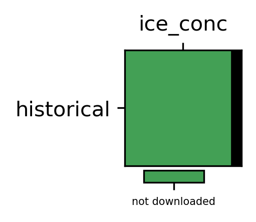
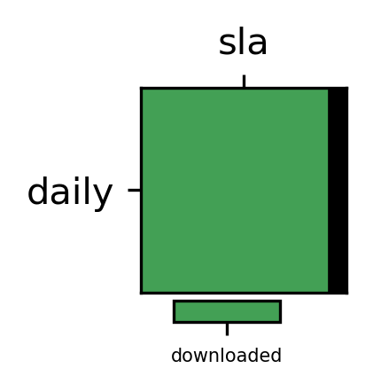
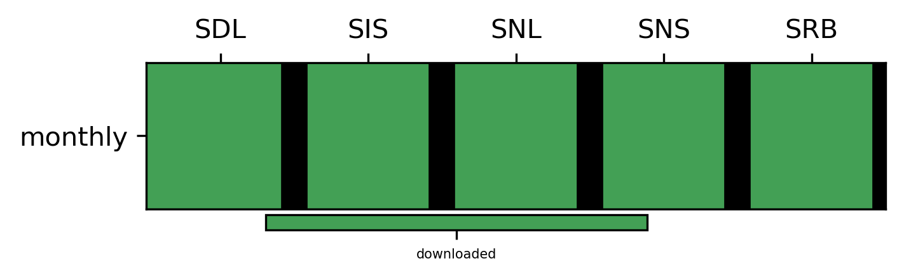

# Catalogue Overview

## derived-era5-single-levels-daily-statistics catalogue

## derived-utci-historical catalogue

## insitu-gridded-observations-europe catalogue

## reanalysis-cerra-land catalogue

## reanalysis-cerra-single-levels catalogue

## reanalysis-era5-single-levels catalogue

## satellite-sea-ice-concentration nh catalogue

## satellite-sea-ice-concentration sh catalogue

## satellite-sea-level-global catalogue

## satellite-surface-radiation-budget catalogue

## All Catalogues Table

| variable   |   model |   experiment | dataset                                     | dataset_type   | product_type   | temporal_resolution   | interpolation   | data_path                                                                                                                                              | origin_path                                                                                                                                                                                                                           | start_file_exists   | final_file_exists   |    earliest_date |      latest_date | script                                                          |
|:-----------|--------:|-------------:|:--------------------------------------------|:---------------|:---------------|:----------------------|:----------------|:-------------------------------------------------------------------------------------------------------------------------------------------------------|:--------------------------------------------------------------------------------------------------------------------------------------------------------------------------------------------------------------------------------------|:--------------------|:--------------------|-----------------:|-----------------:|:----------------------------------------------------------------|
| t2m        |     nan |          nan | derived-era5-single-levels-daily-statistics | reanalysis     | raw            | daily                 | native          | /lustre/gmeteo/WORK/DATA/C3S-CDS/CDS-Curated-Data/raw/derived-era5-single-levels-daily-statistics/daily/native/t2m                                     | CDS                                                                                                                                                                                                                                   | True                | True                |   1940           |   2024           | scripts/download/derived-era5-single-levels-daily-statistics.py |
| t2mx       |     nan |          nan | derived-era5-single-levels-daily-statistics | reanalysis     | raw            | daily                 | native          | /lustre/gmeteo/WORK/DATA/C3S-CDS/CDS-Curated-Data/raw/derived-era5-single-levels-daily-statistics/daily/native/t2mx                                    | CDS                                                                                                                                                                                                                                   | True                | True                |   1940           |   2024           | scripts/download/derived-era5-single-levels-daily-statistics.py |
| t2mn       |     nan |          nan | derived-era5-single-levels-daily-statistics | reanalysis     | raw            | daily                 | native          | /lustre/gmeteo/WORK/DATA/C3S-CDS/CDS-Curated-Data/raw/derived-era5-single-levels-daily-statistics/daily/native/t2mn                                    | CDS                                                                                                                                                                                                                                   | True                | True                |   1940           |   2024           | scripts/download/derived-era5-single-levels-daily-statistics.py |
| e          |     nan |          nan | derived-era5-single-levels-daily-statistics | reanalysis     | raw            | daily                 | native          | /lustre/gmeteo/WORK/DATA/C3S-CDS/CDS-Curated-Data/raw/derived-era5-single-levels-daily-statistics/daily/native/e                                       | CDS                                                                                                                                                                                                                                   | True                | True                |   1940           |   2024           | scripts/download/derived-era5-single-levels-daily-statistics.py |
| tp         |     nan |          nan | derived-era5-single-levels-daily-statistics | reanalysis     | raw            | daily                 | native          | /lustre/gmeteo/WORK/DATA/C3S-CDS/CDS-Curated-Data/raw/derived-era5-single-levels-daily-statistics/daily/native/tp                                      | CDS                                                                                                                                                                                                                                   | True                | True                |   1940           |   2024           | scripts/download/derived-era5-single-levels-daily-statistics.py |
| d2m        |     nan |          nan | derived-era5-single-levels-daily-statistics | reanalysis     | raw            | daily                 | native          | /lustre/gmeteo/WORK/DATA/C3S-CDS/CDS-Curated-Data/raw/derived-era5-single-levels-daily-statistics/daily/native/d2m                                     | CDS                                                                                                                                                                                                                                   | True                | True                |   1940           |   2024           | scripts/download/derived-era5-single-levels-daily-statistics.py |
| sp         |     nan |          nan | derived-era5-single-levels-daily-statistics | reanalysis     | raw            | daily                 | native          | /lustre/gmeteo/WORK/DATA/C3S-CDS/CDS-Curated-Data/raw/derived-era5-single-levels-daily-statistics/daily/native/sp                                      | CDS                                                                                                                                                                                                                                   | True                | True                |   1940           |   2024           | scripts/download/derived-era5-single-levels-daily-statistics.py |
| msl        |     nan |          nan | derived-era5-single-levels-daily-statistics | reanalysis     | raw            | daily                 | native          | /lustre/gmeteo/WORK/DATA/C3S-CDS/CDS-Curated-Data/raw/derived-era5-single-levels-daily-statistics/daily/native/msl                                     | CDS                                                                                                                                                                                                                                   | True                | False               |   1940           |   2021           | scripts/download/derived-era5-single-levels-daily-statistics.py |
| ssrd       |     nan |          nan | derived-era5-single-levels-daily-statistics | reanalysis     | raw            | daily                 | native          | /lustre/gmeteo/WORK/DATA/C3S-CDS/CDS-Curated-Data/raw/derived-era5-single-levels-daily-statistics/daily/native/ssrd                                    | CDS                                                                                                                                                                                                                                   | True                | True                |   1940           |   2024           | scripts/download/derived-era5-single-levels-daily-statistics.py |
| tg         |     nan |          nan | insitu-gridded-observations-europe          | observation    | raw            | daily                 | native          | /lustre/gmeteo/WORK/DATA/C3S-CDS/CDS-Curated-Data/raw/insitu-gridded-observations-europe/daily/native/tg                                               | CDS                                                                                                                                                                                                                                   | True                | True                |      1.9502e+07  |      1.9502e+07  | scripts/download/insitu-gridded-observations-europe.py          |
| tx         |     nan |          nan | insitu-gridded-observations-europe          | observation    | raw            | daily                 | native          | /lustre/gmeteo/WORK/DATA/C3S-CDS/CDS-Curated-Data/raw/insitu-gridded-observations-europe/daily/native/tx                                               | CDS                                                                                                                                                                                                                                   | True                | True                |      1.9502e+07  |      1.9502e+07  | scripts/download/insitu-gridded-observations-europe.py          |
| tn         |     nan |          nan | insitu-gridded-observations-europe          | observation    | raw            | daily                 | native          | /lustre/gmeteo/WORK/DATA/C3S-CDS/CDS-Curated-Data/raw/insitu-gridded-observations-europe/daily/native/tn                                               | CDS                                                                                                                                                                                                                                   | True                | True                |      1.9502e+07  |      1.9502e+07  | scripts/download/insitu-gridded-observations-europe.py          |
| fg         |     nan |          nan | insitu-gridded-observations-europe          | observation    | raw            | daily                 | native          | /lustre/gmeteo/WORK/DATA/C3S-CDS/CDS-Curated-Data/raw/insitu-gridded-observations-europe/daily/native/fg                                               | CDS                                                                                                                                                                                                                                   | True                | True                |      1.9502e+07  |      1.9502e+07  | scripts/download/insitu-gridded-observations-europe.py          |
| rr         |     nan |          nan | insitu-gridded-observations-europe          | observation    | raw            | daily                 | native          | /lustre/gmeteo/WORK/DATA/C3S-CDS/CDS-Curated-Data/raw/insitu-gridded-observations-europe/daily/native/rr                                               | CDS                                                                                                                                                                                                                                   | True                | True                |      1.9502e+07  |      1.9502e+07  | scripts/download/insitu-gridded-observations-europe.py          |
| qq         |     nan |          nan | insitu-gridded-observations-europe          | observation    | raw            | daily                 | native          | /lustre/gmeteo/WORK/DATA/C3S-CDS/CDS-Curated-Data/raw/insitu-gridded-observations-europe/daily/native/qq                                               | CDS                                                                                                                                                                                                                                   | True                | True                |      1.9502e+07  |      1.9502e+07  | scripts/download/insitu-gridded-observations-europe.py          |
| sla        |     nan |          nan | satellite-sea-level-global                  | observation    | raw            | daily                 | native          | /lustre/gmeteo/WORK/DATA/C3S-CDS/CDS-Curated-Data/raw/satellite-sea-level-global/daily/native/sla                                                      | CDS                                                                                                                                                                                                                                   | True                | True                |      1.99301e+07 |      2.02312e+07 | scripts/download/satellite-sea-level-global.py                  |
| t2m        |     nan |          nan | reanalysis-cerra-single-levels              | reanalysis     | derived        | hourly                | gr006           | /lustre/gmeteo/WORK/DATA/C3S-CDS/CDS-Curated-Data/derived/reanalysis-cerra-single-levels/hourly/gr006/t2m                                              | /lustre/gmeteo/WORK/DATA/C3S-CDS/CDS-Curated-Data/raw/reanalysis-cerra-single-levels/hourly/native/t2m                                                                                                                                | True                | True                | 198801           | 201712           | scripts/interpolation/reanalysis-cerra-single-levels.py         |
| r2         |     nan |          nan | reanalysis-cerra-single-levels              | reanalysis     | derived        | hourly                | gr006           | /lustre/gmeteo/WORK/DATA/C3S-CDS/CDS-Curated-Data/derived/reanalysis-cerra-single-levels/hourly/gr006/r2                                               | /lustre/gmeteo/WORK/DATA/C3S-CDS/CDS-Curated-Data/raw/reanalysis-cerra-single-levels/hourly/native/r2                                                                                                                                 | True                | True                | 198801           | 201712           | scripts/interpolation/reanalysis-cerra-single-levels.py         |
| si10       |     nan |          nan | reanalysis-cerra-single-levels              | reanalysis     | derived        | hourly                | gr006           | /lustre/gmeteo/WORK/DATA/C3S-CDS/CDS-Curated-Data/derived/reanalysis-cerra-single-levels/hourly/gr006/si10                                             | /lustre/gmeteo/WORK/DATA/C3S-CDS/CDS-Curated-Data/raw/reanalysis-cerra-single-levels/hourly/native/si10                                                                                                                               | True                | True                | 198801           | 201712           | scripts/interpolation/reanalysis-cerra-single-levels.py         |
| ssrd       |     nan |          nan | reanalysis-cerra-single-levels              | reanalysis     | derived        | hourly                | gr006           | /lustre/gmeteo/WORK/DATA/C3S-CDS/CDS-Curated-Data/derived/reanalysis-cerra-single-levels/hourly/gr006/ssrd                                             | /lustre/gmeteo/WORK/DATA/C3S-CDS/CDS-Curated-Data/raw/reanalysis-cerra-single-levels/hourly/native/ssrd                                                                                                                               | True                | True                | 198801           | 201712           | scripts/interpolation/reanalysis-cerra-single-levels.py         |
| ice_conc   |     nan |          nan | satellite-sea-ice-concentration             | observations   | derived        | daily                 | gr025           | /lustre/gmeteo/WORK/DATA/C3S-CDS/CDS-Curated-Data/derived/satellite-sea-ice-concentration/daily/gr025/ice_conc                                         | CDS                                                                                                                                                                                                                                   | False               | False               |    nan           |    nan           | scripts/download/satellite-sea-ice-concentration.py             |
| ice_conc   |     nan |          nan | satellite-sea-ice-concentration             | observations   | derived        | daily                 | gr025           | /lustre/gmeteo/WORK/DATA/C3S-CDS/CDS-Curated-Data/derived/satellite-sea-ice-concentration/daily/gr025/ice_conc                                         | CDS                                                                                                                                                                                                                                   | False               | False               |    nan           |    nan           | scripts/download/satellite-sea-ice-concentration.py             |
| u10        |     nan |          nan | reanalysis-era5-single-levels               | reanalysis     | raw            | hourly                | native          | /lustre/gmeteo/WORK/DATA/C3S-CDS/CDS-Curated-Data/raw/reanalysis-era5-single-levels/hourly/native/u10                                                  | CDS                                                                                                                                                                                                                                   | True                | True                |   1940           |   2024           | scripts/download/reanalysis-era5-single-levels.py               |
| v10        |     nan |          nan | reanalysis-era5-single-levels               | reanalysis     | raw            | hourly                | native          | /lustre/gmeteo/WORK/DATA/C3S-CDS/CDS-Curated-Data/raw/reanalysis-era5-single-levels/hourly/native/v10                                                  | CDS                                                                                                                                                                                                                                   | True                | True                |   1940           |   2024           | scripts/download/reanalysis-era5-single-levels.py               |
| d2m        |     nan |          nan | reanalysis-era5-single-levels               | reanalysis     | raw            | hourly                | native          | /lustre/gmeteo/WORK/DATA/C3S-CDS/CDS-Curated-Data/raw/reanalysis-era5-single-levels/hourly/native/d2m                                                  | CDS                                                                                                                                                                                                                                   | True                | True                |   1940           |   2020           | scripts/derived/reanalysis-era5-single-levels.py                |
| t2m        |     nan |          nan | reanalysis-era5-single-levels               | reanalysis     | raw            | hourly                | native          | /lustre/gmeteo/WORK/DATA/C3S-CDS/CDS-Curated-Data/raw/reanalysis-era5-single-levels/hourly/native/t2m                                                  | CDS                                                                                                                                                                                                                                   | True                | True                |   2020           |   2020           | scripts/derived/reanalysis-era5-single-levels.py                |
| ssr        |     nan |          nan | reanalysis-era5-single-levels               | reanalysis     | raw            | hourly                | native          | /lustre/gmeteo/WORK/DATA/C3S-CDS/CDS-Curated-Data/raw/reanalysis-era5-single-levels/hourly/native/ssr                                                  | /lustre/gmeteo/WORK/DATA/C3S-CDS/CDS-Curated-Data/raw/reanalysis-era5-single-levels/hourly/native/ssr                                                                                                                                 | True                | True                |   2020           |   2020           | scripts/download/reanalysis-era5-single-levels.py               |
| str        |     nan |          nan | reanalysis-era5-single-levels               | reanalysis     | raw            | hourly                | native          | /lustre/gmeteo/WORK/DATA/C3S-CDS/CDS-Curated-Data/raw/reanalysis-era5-single-levels/hourly/native/str                                                  | /lustre/gmeteo/WORK/DATA/C3S-CDS/CDS-Curated-Data/raw/reanalysis-era5-single-levels/hourly/native/str                                                                                                                                 | True                | True                |   2020           |   2020           | scripts/download/reanalysis-era5-single-levels.py               |
| ssrd       |     nan |          nan | reanalysis-era5-single-levels               | reanalysis     | raw            | hourly                | native          | /lustre/gmeteo/WORK/DATA/C3S-CDS/CDS-Curated-Data/raw/reanalysis-era5-single-levels/hourly/native/ssrd                                                 | /lustre/gmeteo/WORK/DATA/C3S-CDS/CDS-Curated-Data/raw/reanalysis-era5-single-levels/hourly/native/ssrd                                                                                                                                | True                | True                |   2020           |   2020           | scripts/download/reanalysis-era5-single-levels.py               |
| strd       |     nan |          nan | reanalysis-era5-single-levels               | reanalysis     | raw            | hourly                | native          | /lustre/gmeteo/WORK/DATA/C3S-CDS/CDS-Curated-Data/raw/reanalysis-era5-single-levels/hourly/native/strd                                                 | /lustre/gmeteo/WORK/DATA/C3S-CDS/CDS-Curated-Data/raw/reanalysis-era5-single-levels/hourly/native/strd                                                                                                                                | True                | True                |   2020           |   2020           | scripts/download/reanalysis-era5-single-levels.py               |
| SDL        |     nan |          nan | satellite-surface-radiation-budget          | observations   | raw            | daily                 | native          | /lustre/gmeteo/WORK/DATA/C3S-CDS/CDS-Curated-Data/raw/satellite-surface-radiation-budget/daily/native/SDL                                              | CDS                                                                                                                                                                                                                                   | True                | True                | 197901           | 202506           | scripts/download/satellite-surface-radiation-budget.py          |
| SIS        |     nan |          nan | satellite-surface-radiation-budget          | observations   | raw            | daily                 | native          | /lustre/gmeteo/WORK/DATA/C3S-CDS/CDS-Curated-Data/raw/satellite-surface-radiation-budget/daily/native/SIS                                              | CDS                                                                                                                                                                                                                                   | True                | True                | 197901           | 202506           | scripts/download/satellite-surface-radiation-budget.py          |
| SNL        |     nan |          nan | satellite-surface-radiation-budget          | observations   | raw            | daily                 | native          | /lustre/gmeteo/WORK/DATA/C3S-CDS/CDS-Curated-Data/raw/satellite-surface-radiation-budget/daily/native/SNL                                              | CDS                                                                                                                                                                                                                                   | True                | True                | 197901           | 202506           | scripts/download/satellite-surface-radiation-budget.py          |
| SNS        |     nan |          nan | satellite-surface-radiation-budget          | observations   | raw            | daily                 | native          | /lustre/gmeteo/WORK/DATA/C3S-CDS/CDS-Curated-Data/raw/satellite-surface-radiation-budget/daily/native/SNS                                              | CDS                                                                                                                                                                                                                                   | True                | True                | 197901           | 202506           | scripts/download/satellite-surface-radiation-budget.py          |
| SRB        |     nan |          nan | satellite-surface-radiation-budget          | observations   | raw            | daily                 | native          | /lustre/gmeteo/WORK/DATA/C3S-CDS/CDS-Curated-Data/raw/satellite-surface-radiation-budget/daily/native/SRB                                              | CDS                                                                                                                                                                                                                                   | True                | True                | 197901           | 202506           | scripts/download/satellite-surface-radiation-budget.py          |
| eva        |     nan |          nan | reanalysis-cerra-land                       | reanalysis     | derived        | daily                 | native          | /lustre/gmeteo/WORK/DATA/C3S-CDS/CDS-Curated-Data/derived/reanalysis-cerra-land/daily/native/eva                                                       | /lustre/gmeteo/WORK/DATA/C3S-CDS/CDS-Curated-Data/raw/reanalysis-cerra-land/daily/native/eva                                                                                                                                          | True                | False               | 198501           | 202108           | scripts/derived/reanalysis-cerra-land_accumulation.py           |
| ssrd       |     nan |          nan | reanalysis-cerra-land                       | reanalysis     | derived        | daily                 | native          | /lustre/gmeteo/WORK/DATA/C3S-CDS/CDS-Curated-Data/derived/reanalysis-cerra-land/daily/native/ssrd                                                      | /lustre/gmeteo/WORK/DATA/C3S-CDS/CDS-Curated-Data/raw/reanalysis-cerra-land/daily/native/ssrd                                                                                                                                         | True                | False               | 198501           | 202012           | scripts/derived/reanalysis-cerra-land_accumulation.py           |
| strd       |     nan |          nan | reanalysis-cerra-land                       | reanalysis     | derived        | daily                 | native          | /lustre/gmeteo/WORK/DATA/C3S-CDS/CDS-Curated-Data/derived/reanalysis-cerra-land/daily/native/strd                                                      | /lustre/gmeteo/WORK/DATA/C3S-CDS/CDS-Curated-Data/raw/reanalysis-cerra-land/daily/native/strd                                                                                                                                         | True                | False               | 198501           | 202012           | scripts/derived/reanalysis-cerra-land_accumulation.py           |
| hurs       |     nan |          nan | derived-era5-single-levels-daily-statistics | reanalysis     | derived        | daily                 | native          | /lustre/gmeteo/WORK/DATA/C3S-CDS/CDS-Curated-Data/derived/derived-era5-single-levels-daily-statistics/daily/native/hurs                                | /lustre/gmeteo/WORK/DATA/C3S-CDS/CDS-Curated-Data/raw/derived-era5-single-levels-daily-statistics/daily/native/d2m;/lustre/gmeteo/WORK/DATA/C3S-CDS/CDS-Curated-Data/raw/derived-era5-single-levels-daily-statistics/daily/native/t2m | True                | True                |   1940           |   2024           | scripts/derived/derived-era5-single-levels-daily-statistics.py  |
| huss       |     nan |          nan | derived-era5-single-levels-daily-statistics | reanalysis     | derived        | daily                 | native          | /lustre/gmeteo/WORK/DATA/C3S-CDS/CDS-Curated-Data/derived/derived-era5-single-levels-daily-statistics/daily/native/huss                                | /lustre/gmeteo/WORK/DATA/C3S-CDS/CDS-Curated-Data/raw/derived-era5-single-levels-daily-statistics/daily/native/d2m;/lustre/gmeteo/WORK/DATA/C3S-CDS/CDS-Curated-Data/raw/derived-era5-single-levels-daily-statistics/daily/native/ps  | True                | True                |   1940           |   2024           | scripts/derived/derived-era5-single-levels-daily-statistics.py  |
| t2m        |     nan |          nan | derived-era5-single-levels-daily-statistics | reanalysis     | derived        | daily                 | gr100           | /lustre/gmeteo/PTICLIMA/DATA/REANALYSIS/ERA5/data_derived/medcof_1degree/day/t2m/derived/derived-era5-single-levels-daily-statistics/daily/gr100/t2m   | /lustre/gmeteo/WORK/DATA/C3S-CDS/CDS-Curated-Data/raw/derived-era5-single-levels-daily-statistics/daily/native/t2m                                                                                                                    | False               | False               |    nan           |    nan           | scripts/interpolation/era5-single-levels-daily-Medcof.py        |
| t2mx       |     nan |          nan | derived-era5-single-levels-daily-statistics | reanalysis     | derived        | daily                 | gr100           | /lustre/gmeteo/PTICLIMA/DATA/REANALYSIS/ERA5/data_derived/medcof_1degree/day/t2mx/derived/derived-era5-single-levels-daily-statistics/daily/gr100/t2mx | /lustre/gmeteo/WORK/DATA/C3S-CDS/CDS-Curated-Data/raw/derived-era5-single-levels-daily-statistics/daily/native/t2mx                                                                                                                   | False               | False               |    nan           |    nan           | scripts/interpolation/era5-single-levels-daily-Medcof.py        |
| t2mn       |     nan |          nan | derived-era5-single-levels-daily-statistics | reanalysis     | derived        | daily                 | gr100           | /lustre/gmeteo/PTICLIMA/DATA/REANALYSIS/ERA5/data_derived/medcof_1degree/day/t2mn/derived/derived-era5-single-levels-daily-statistics/daily/gr100/t2mn | /lustre/gmeteo/WORK/DATA/C3S-CDS/CDS-Curated-Data/raw/derived-era5-single-levels-daily-statistics/daily/native/t2mn                                                                                                                   | False               | False               |    nan           |    nan           | scripts/interpolation/era5-single-levels-daily-Medcof.py        |
| tp         |     nan |          nan | derived-era5-single-levels-daily-statistics | reanalysis     | derived        | daily                 | gr100           | /lustre/gmeteo/PTICLIMA/DATA/REANALYSIS/ERA5/data_derived/medcof_1degree/day/tp/derived/derived-era5-single-levels-daily-statistics/daily/gr100/tp     | /lustre/gmeteo/WORK/DATA/C3S-CDS/CDS-Curated-Data/raw/derived-era5-single-levels-daily-statistics/daily/native/tp                                                                                                                     | False               | False               |    nan           |    nan           | scripts/interpolation/era5-single-levels-daily-Medcof.py        |
| ssrd       |     nan |          nan | derived-era5-single-levels-daily-statistics | reanalysis     | derived        | daily                 | gr100           | /lustre/gmeteo/PTICLIMA/DATA/REANALYSIS/ERA5/data_derived/medcof_1degree/day/ssrd/derived/derived-era5-single-levels-daily-statistics/daily/gr100/ssrd | /lustre/gmeteo/WORK/DATA/C3S-CDS/CDS-Curated-Data/raw/derived-era5-single-levels-daily-statistics/daily/native/ssrd                                                                                                                   | False               | False               |    nan           |    nan           | scripts/interpolation/era5-single-levels-daily-Medcof.py        |
| e          |     nan |          nan | derived-era5-single-levels-daily-statistics | reanalysis     | derived        | daily                 | gr100           | /lustre/gmeteo/PTICLIMA/DATA/REANALYSIS/ERA5/data_derived/medcof_1degree/day/e/derived/derived-era5-single-levels-daily-statistics/daily/gr100/e       | /lustre/gmeteo/WORK/DATA/C3S-CDS/CDS-Curated-Data/raw/derived-era5-single-levels-daily-statistics/daily/native/e                                                                                                                      | False               | False               |    nan           |    nan           | scripts/interpolation/era5-single-levels-daily-Medcof.py        |
| hurs       |     nan |          nan | derived-era5-single-levels-daily-statistics | reanalysis     | derived        | daily                 | gr100           | /lustre/gmeteo/PTICLIMA/DATA/REANALYSIS/ERA5/data_derived/medcof_1degree/day/hurs/derived/derived-era5-single-levels-daily-statistics/daily/gr100/hurs | /lustre/gmeteo/WORK/DATA/C3S-CDS/CDS-Curated-Data/raw/derived-era5-single-levels-daily-statistics/daily/native/d2m;/lustre/gmeteo/WORK/DATA/C3S-CDS/CDS-Curated-Data/raw/derived-era5-single-levels-daily-statistics/daily/native/t2m | False               | False               |    nan           |    nan           | scripts/interpolation/era5-single-levels-daily-Medcof.py        |
| huss       |     nan |          nan | derived-era5-single-levels-daily-statistics | reanalysis     | derived        | daily                 | gr100           | /lustre/gmeteo/PTICLIMA/DATA/REANALYSIS/ERA5/data_derived/medcof_1degree/day/huss/derived/derived-era5-single-levels-daily-statistics/daily/gr100/huss | /lustre/gmeteo/WORK/DATA/C3S-CDS/CDS-Curated-Data/raw/derived-era5-single-levels-daily-statistics/daily/native/d2m;/lustre/gmeteo/WORK/DATA/C3S-CDS/CDS-Curated-Data/raw/derived-era5-single-levels-daily-statistics/daily/native/ps  | False               | False               |    nan           |    nan           | scripts/interpolation/era5-single-levels-daily-Medcof.py        |
| msl        |     nan |          nan | derived-era5-single-levels-daily-statistics | reanalysis     | derived        | daily                 | gr100           | /lustre/gmeteo/PTICLIMA/DATA/REANALYSIS/ERA5/data_derived/medcof_1degree/day/huss/derived/derived-era5-single-levels-daily-statistics/daily/gr100/msl  | /lustre/gmeteo/WORK/DATA/C3S-CDS/CDS-Curated-Data/raw/derived-era5-single-levels-daily-statistics/daily/native/msl                                                                                                                    | False               | False               |    nan           |    nan           | scripts/interpolation/era5-single-levels-daily-Medcof.py        |
| utci       |     nan |          nan | derived-utci-historical                     | reanalysis     | raw            | daily                 | native          | /lustre/gmeteo/WORK/DATA/C3S-CDS/CDS-Curated-Data/raw/derived-utci-historical/daily/native/utci                                                        | CDS                                                                                                                                                                                                                                   | False               | False               |    nan           |    nan           | scripts/download/derived-utci-historical.py                     |
| mrt        |     nan |          nan | derived-utci-historical                     | reanalysis     | raw            | daily                 | native          | /lustre/gmeteo/WORK/DATA/C3S-CDS/CDS-Curated-Data/raw/derived-utci-historical/daily/native/mrt                                                         | CDS                                                                                                                                                                                                                                   | False               | True                | 202001           |      2.02012e+07 | scripts/download/derived-utci-historical.py                     |
| ice_conc   |     nan |          nan | satellite-sea-ice-concentration             | observations   | raw            | daily                 | native          | /lustre/gmeteo/WORK/DATA/C3S-CDS/CDS-Curated-Data/raw/satellite-sea-ice-concentration/daily/native/ice_conc                                            | CDS                                                                                                                                                                                                                                   | False               | False               |    nan           |    nan           | scripts/download/satellite-sea-ice-concentration.py             |
| tp         |     nan |          nan | reanalysis-cerra-land                       | reanalysis     | raw            | daily                 | native          | /lustre/gmeteo/WORK/DATA/C3S-CDS/CDS-Curated-Data/raw/reanalysis-cerra-land/daily/native/tp                                                            | CDS                                                                                                                                                                                                                                   | True                | True                | 198408           | 202507           | scripts/download/reanalysis-cerra-land-single-levels.py         |
| eva        |     nan |          nan | reanalysis-cerra-land                       | reanalysis     | raw            | hourly                | native          | /lustre/gmeteo/WORK/DATA/C3S-CDS/CDS-Curated-Data/raw/reanalysis-cerra-land/hourly/native/eva                                                          | CDS                                                                                                                                                                                                                                   | True                | True                | 198501           | 202507           | scripts/download/reanalysis-cerra-land-single-levels.py         |
| ssrd       |     nan |          nan | reanalysis-cerra-land                       | reanalysis     | raw            | hourly                | native          | /lustre/gmeteo/WORK/DATA/C3S-CDS/CDS-Curated-Data/raw/reanalysis-cerra-land/hourly/native/ssrd                                                         | CDS                                                                                                                                                                                                                                   | True                | False               | 198501           | 202308           | scripts/download/reanalysis-cerra-land-single-levels.py         |
| strd       |     nan |          nan | reanalysis-cerra-land                       | reanalysis     | raw            | hourly                | native          | /lustre/gmeteo/WORK/DATA/C3S-CDS/CDS-Curated-Data/raw/reanalysis-cerra-land/hourly/native/strd                                                         | CDS                                                                                                                                                                                                                                   | True                | False               | 198501           | 202012           | scripts/download/reanalysis-cerra-land-single-levels.py         |
| vsw        |     nan |          nan | reanalysis-cerra-land                       | reanalysis     | raw            | hourly                | native          | /lustre/gmeteo/WORK/DATA/C3S-CDS/CDS-Curated-Data/raw/reanalysis-cerra-land/hourly/native/vsw                                                          | CDS                                                                                                                                                                                                                                   | True                | False               | 198501           | 202012           | scripts/download/reanalysis-cerra-land-single-levels.py         |
| t2m        |     nan |          nan | reanalysis-cerra-single-levels              | reanalysis     | raw            | hourly                | native          | /lustre/gmeteo/WORK/DATA/C3S-CDS/CDS-Curated-Data/raw/reanalysis-cerra-single-levels/hourly/native/t2m                                                 | CDS                                                                                                                                                                                                                                   | True                | True                | 198801           | 201712           | scripts/download/reanalysis-cerra-single-levels.py              |
| r2         |     nan |          nan | reanalysis-cerra-single-levels              | reanalysis     | raw            | hourly                | native          | /lustre/gmeteo/WORK/DATA/C3S-CDS/CDS-Curated-Data/raw/reanalysis-cerra-single-levels/hourly/native/r2                                                  | CDS                                                                                                                                                                                                                                   | True                | True                | 198801           | 201712           | scripts/download/reanalysis-cerra-single-levels.py              |
| si10       |     nan |          nan | reanalysis-cerra-single-levels              | reanalysis     | raw            | hourly                | native          | /lustre/gmeteo/WORK/DATA/C3S-CDS/CDS-Curated-Data/raw/reanalysis-cerra-single-levels/hourly/native/si10                                                | CDS                                                                                                                                                                                                                                   | True                | True                | 198801           | 201712           | scripts/download/reanalysis-cerra-single-levels.py              |
| ssrd       |     nan |          nan | reanalysis-cerra-single-levels              | reanalysis     | raw            | hourly                | native          | /lustre/gmeteo/WORK/DATA/C3S-CDS/CDS-Curated-Data/raw/reanalysis-cerra-single-levels/hourly/native/ssrd                                                | CDS                                                                                                                                                                                                                                   | True                | True                | 198801           | 201712           | scripts/download/reanalysis-cerra-single-levels.py              |
| ice_conc   |     nan |          nan | satellite-sea-ice-concentration             | observations   | raw            | daily                 | native          | /lustre/gmeteo/WORK/DATA/C3S-CDS/CDS-Curated-Data/raw/satellite-sea-ice-concentration/daily/native/ice_conc                                            | CDS                                                                                                                                                                                                                                   | False               | False               |    nan           |    nan           | scripts/download/satellite-sea-ice-concentration.py             |
| sfcwind    |     nan |          nan | reanalysis-era5-single-levels               | reanalysis     | derived        | daily                 | native          | /lustre/gmeteo/WORK/DATA/C3S-CDS/CDS-Curated-Data/derived/reanalysis-era5-single-levels/daily/native/sfcwind                                           | /lustre/gmeteo/WORK/DATA/C3S-CDS/CDS-Curated-Data/raw/reanalysis-era5-single-levels/daily/native/u10;/lustre/gmeteo/WORK/DATA/C3S-CDS/CDS-Curated-Data/raw/reanalysis-era5-single-levels/daily/native/v10                             | True                | True                |   1940           |   2024           | scripts/derived/reanalysis-era5-single-levels.py                |
| sfcwind    |     nan |          nan | reanalysis-era5-single-levels               | reanalysis     | derived        | hourly                | native          | /lustre/gmeteo/WORK/DATA/C3S-CDS/CDS-Curated-Data/derived/reanalysis-era5-single-levels/hourly/native/sfcwind                                          | /lustre/gmeteo/WORK/DATA/C3S-CDS/CDS-Curated-Data/raw/reanalysis-era5-single-levels/hourly/native/u10;/lustre/gmeteo/WORK/DATA/C3S-CDS/CDS-Curated-Data/raw/reanalysis-era5-single-levels/hourly/native/v10                           | True                | True                |   1940           |   2020           | scripts/derived/reanalysis-era5-single-levels.py                |
| hurs       |     nan |          nan | reanalysis-era5-single-levels               | reanalysis     | derived        | hourly                | native          | /lustre/gmeteo/WORK/DATA/C3S-CDS/CDS-Curated-Data/derived/reanalysis-era5-single-levels/hourly/native/hurs                                             | /lustre/gmeteo/WORK/DATA/C3S-CDS/CDS-Curated-Data/raw/reanalysis-era5-single-levels/hourly/native/d2m;/lustre/gmeteo/WORK/DATA/C3S-CDS/CDS-Curated-Data/raw/reanalysis-era5-single-levels/hourly/native/t2m                           | True                | True                | 202001           | 202012           | scripts/derived/reanalysis-era5-single-levels.py                |
| sfcwind    |     nan |          nan | reanalysis-era5-single-levels               | reanalysis     | derived        | daily                 | gr100           | /lustre/gmeteo/PTICLIMA/DATA/REANALYSIS/ERA5/data_derived/medcof_1degree/day/sfcwind/derived/reanalysis-era5-single-levels/daily/gr100/sfcwind         | /lustre/gmeteo/WORK/DATA/C3S-CDS/CDS-Curated-Data/raw/reanalysis-era5-single-levels/daily/native/u10;/lustre/gmeteo/WORK/DATA/C3S-CDS/CDS-Curated-Data/raw/reanalysis-era5-single-levels/daily/native/v10                             | False               | False               |    nan           |    nan           | scripts/interpolation/era5-single-levels-daily-Medcof.py        |