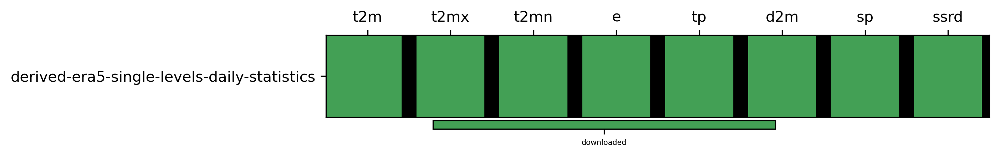
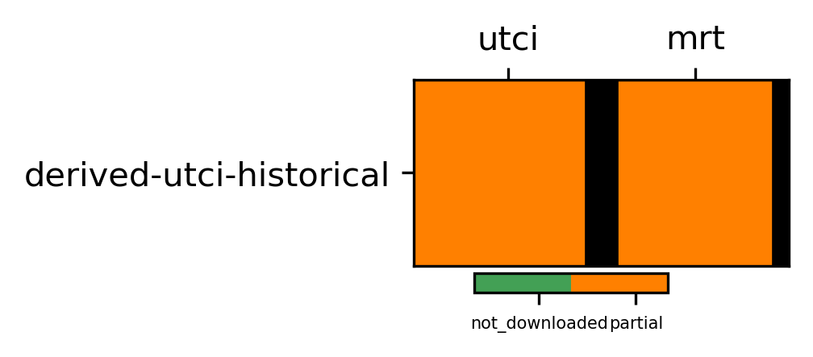
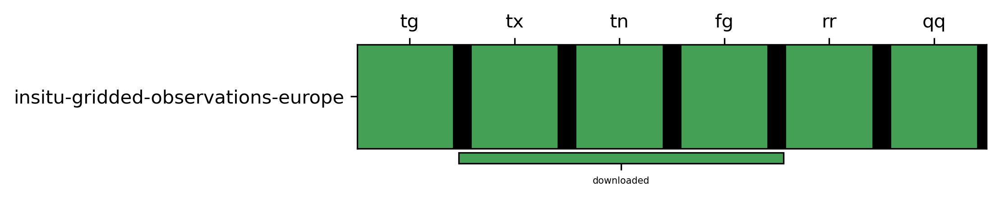
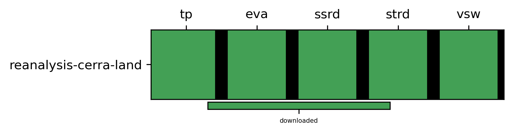
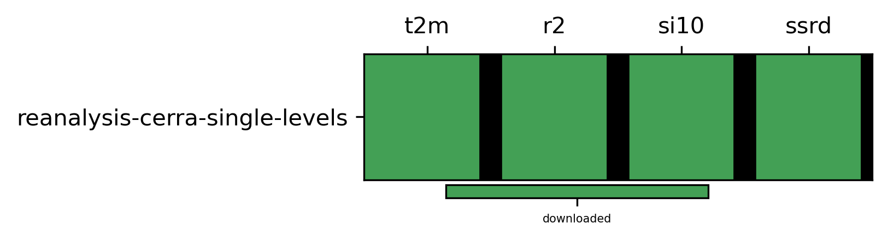
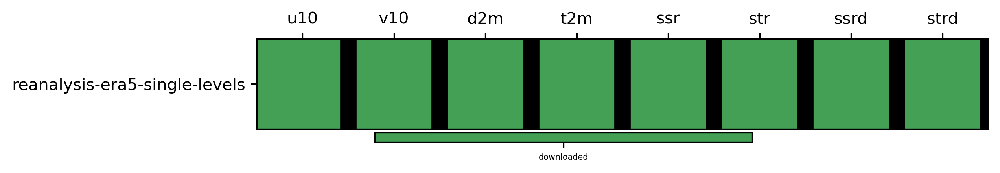

# Catalogue Overview

## derived-era5-single-levels-daily-statistics catalogue

## derived-utci-historical catalogue

## insitu-gridded-observations-europe catalogue

## reanalysis-cerra-land catalogue

## reanalysis-cerra-single-levels catalogue

## reanalysis-era5-single-levels catalogue

## All Catalogues Table

| variable   | model   | experiment   | dataset                                     | dataset_type   | product_type   | temporal_resolution   | interpolation   | data_path                                                                                                               | origin_path                                                                                                                                                                                                                           | start_file_exists   | final_file_exists   |   earliest_date |      latest_date | script                                                          |
|:-----------|:--------|:-------------|:--------------------------------------------|:---------------|:---------------|:----------------------|:----------------|:------------------------------------------------------------------------------------------------------------------------|:--------------------------------------------------------------------------------------------------------------------------------------------------------------------------------------------------------------------------------------|:--------------------|:--------------------|----------------:|-----------------:|:----------------------------------------------------------------|
| tg         | None    | None         | insitu-gridded-observations-europe          | observation    | raw            | daily                 | native          | /lustre/gmeteo/WORK/DATA/C3S-CDS/CDS-Curated-Data/raw/insitu-gridded-observations-europe/daily/native/tg                | CDS                                                                                                                                                                                                                                   | True                | True                |      1.9502e+07 |      1.9502e+07  | scripts/download/insitu-gridded-observations-europe.py          |
| tx         | None    | None         | insitu-gridded-observations-europe          | observation    | raw            | daily                 | native          | /lustre/gmeteo/WORK/DATA/C3S-CDS/CDS-Curated-Data/raw/insitu-gridded-observations-europe/daily/native/tx                | CDS                                                                                                                                                                                                                                   | True                | True                |      1.9502e+07 |      1.9502e+07  | scripts/download/insitu-gridded-observations-europe.py          |
| tn         | None    | None         | insitu-gridded-observations-europe          | observation    | raw            | daily                 | native          | /lustre/gmeteo/WORK/DATA/C3S-CDS/CDS-Curated-Data/raw/insitu-gridded-observations-europe/daily/native/tn                | CDS                                                                                                                                                                                                                                   | True                | True                |      1.9502e+07 |      1.9502e+07  | scripts/download/insitu-gridded-observations-europe.py          |
| fg         | None    | None         | insitu-gridded-observations-europe          | observation    | raw            | daily                 | native          | /lustre/gmeteo/WORK/DATA/C3S-CDS/CDS-Curated-Data/raw/insitu-gridded-observations-europe/daily/native/fg                | CDS                                                                                                                                                                                                                                   | True                | True                |      1.9502e+07 |      1.9502e+07  | scripts/download/insitu-gridded-observations-europe.py          |
| rr         | None    | None         | insitu-gridded-observations-europe          | observation    | raw            | daily                 | native          | /lustre/gmeteo/WORK/DATA/C3S-CDS/CDS-Curated-Data/raw/insitu-gridded-observations-europe/daily/native/rr                | CDS                                                                                                                                                                                                                                   | True                | True                |      1.9502e+07 |      1.9502e+07  | scripts/download/insitu-gridded-observations-europe.py          |
| qq         | None    | None         | insitu-gridded-observations-europe          | observation    | raw            | daily                 | native          | /lustre/gmeteo/WORK/DATA/C3S-CDS/CDS-Curated-Data/raw/insitu-gridded-observations-europe/daily/native/qq                | CDS                                                                                                                                                                                                                                   | True                | True                |      1.9502e+07 |      1.9502e+07  | scripts/download/insitu-gridded-observations-europe.py          |
| utci       | None    | None         | derived-utci-historical                     | reanalysis     | raw            | daily                 | native          | /lustre/gmeteo/WORK/DATA/C3S-CDS/CDS-Curated-Data/raw/derived-utci-historical/daily/native/utci                         | CDS                                                                                                                                                                                                                                   | False               | False               |    nan          |    nan           | scripts/download/derived-utci-historical.py                     |
| mrt        | None    | None         | derived-utci-historical                     | reanalysis     | raw            | daily                 | native          | /lustre/gmeteo/WORK/DATA/C3S-CDS/CDS-Curated-Data/raw/derived-utci-historical/daily/native/mrt                          | CDS                                                                                                                                                                                                                                   | False               | True                | 202001          |      2.02012e+07 | scripts/download/derived-utci-historical.py                     |
| t2m        | None    | None         | reanalysis-cerra-single-levels              | reanalysis     | derived        | hourly                | gr006           | /lustre/gmeteo/WORK/DATA/C3S-CDS/CDS-Curated-Data/derived/reanalysis-cerra-single-levels/hourly/gr006/t2m               | /lustre/gmeteo/WORK/DATA/C3S-CDS/CDS-Curated-Data/raw/reanalysis-cerra-single-levels/hourly/native/t2m                                                                                                                                | True                | True                | 198801          | 201712           | scripts/interpolation/reanalysis-cerra-single-levels.py         |
| r2         | None    | None         | reanalysis-cerra-single-levels              | reanalysis     | derived        | hourly                | gr006           | /lustre/gmeteo/WORK/DATA/C3S-CDS/CDS-Curated-Data/derived/reanalysis-cerra-single-levels/hourly/gr006/r2                | /lustre/gmeteo/WORK/DATA/C3S-CDS/CDS-Curated-Data/raw/reanalysis-cerra-single-levels/hourly/native/r2                                                                                                                                 | True                | True                | 198801          | 201712           | scripts/interpolation/reanalysis-cerra-single-levels.py         |
| si10       | None    | None         | reanalysis-cerra-single-levels              | reanalysis     | derived        | hourly                | gr006           | /lustre/gmeteo/WORK/DATA/C3S-CDS/CDS-Curated-Data/derived/reanalysis-cerra-single-levels/hourly/gr006/si10              | /lustre/gmeteo/WORK/DATA/C3S-CDS/CDS-Curated-Data/raw/reanalysis-cerra-single-levels/hourly/native/si10                                                                                                                               | True                | True                | 198801          | 201712           | scripts/interpolation/reanalysis-cerra-single-levels.py         |
| ssrd       | None    | None         | reanalysis-cerra-single-levels              | reanalysis     | derived        | hourly                | gr006           | /lustre/gmeteo/WORK/DATA/C3S-CDS/CDS-Curated-Data/derived/reanalysis-cerra-single-levels/hourly/gr006/ssrd              | /lustre/gmeteo/WORK/DATA/C3S-CDS/CDS-Curated-Data/raw/reanalysis-cerra-single-levels/hourly/native/ssrd                                                                                                                               | True                | True                | 198801          | 201712           | scripts/interpolation/reanalysis-cerra-single-levels.py         |
| tp         | None    | None         | reanalysis-cerra-land                       | reanalysis     | raw            | daily                 | native          | /lustre/gmeteo/WORK/DATA/C3S-CDS/CDS-Curated-Data/raw/reanalysis-cerra-land/daily/native/tp                             | CDS                                                                                                                                                                                                                                   | True                | True                | 198408          | 202106           | scripts/download/reanalysis-cerra-land-single-levels.py         |
| eva        | None    | None         | reanalysis-cerra-land                       | reanalysis     | raw            | hourly                | native          | /lustre/gmeteo/WORK/DATA/C3S-CDS/CDS-Curated-Data/raw/reanalysis-cerra-land/hourly/native/eva                           | CDS                                                                                                                                                                                                                                   | True                | True                | 198501          | 202109           | scripts/download/reanalysis-cerra-land-single-levels.py         |
| ssrd       | None    | None         | reanalysis-cerra-land                       | reanalysis     | raw            | hourly                | native          | /lustre/gmeteo/WORK/DATA/C3S-CDS/CDS-Curated-Data/raw/reanalysis-cerra-land/hourly/native/ssrd                          | CDS                                                                                                                                                                                                                                   | True                | True                | 198501          | 202012           | scripts/download/reanalysis-cerra-land-single-levels.py         |
| strd       | None    | None         | reanalysis-cerra-land                       | reanalysis     | raw            | hourly                | native          | /lustre/gmeteo/WORK/DATA/C3S-CDS/CDS-Curated-Data/raw/reanalysis-cerra-land/hourly/native/strd                          | CDS                                                                                                                                                                                                                                   | True                | True                | 198501          | 202012           | scripts/download/reanalysis-cerra-land-single-levels.py         |
| vsw        | None    | None         | reanalysis-cerra-land                       | reanalysis     | raw            | hourly                | native          | /lustre/gmeteo/WORK/DATA/C3S-CDS/CDS-Curated-Data/raw/reanalysis-cerra-land/hourly/native/vsw                           | CDS                                                                                                                                                                                                                                   | True                | True                | 198501          | 202012           | scripts/download/reanalysis-cerra-land-single-levels.py         |
| u10        | None    | None         | reanalysis-era5-single-levels               | reanalysis     | raw            | hourly                | native          | /lustre/gmeteo/WORK/DATA/C3S-CDS/CDS-Curated-Data/raw/reanalysis-era5-single-levels/hourly/native/u10                   | CDS                                                                                                                                                                                                                                   | True                | True                |   1940          |   2024           | scripts/download/reanalysis-era5-single-levels.py               |
| v10        | None    | None         | reanalysis-era5-single-levels               | reanalysis     | raw            | hourly                | native          | /lustre/gmeteo/WORK/DATA/C3S-CDS/CDS-Curated-Data/raw/reanalysis-era5-single-levels/hourly/native/v10                   | CDS                                                                                                                                                                                                                                   | True                | True                |   1940          |   2024           | scripts/download/reanalysis-era5-single-levels.py               |
| d2m        | None    | None         | reanalysis-era5-single-levels               | reanalysis     | raw            | hourly                | native          | /lustre/gmeteo/WORK/DATA/C3S-CDS/CDS-Curated-Data/raw/reanalysis-era5-single-levels/hourly/native/d2m                   | CDS                                                                                                                                                                                                                                   | True                | True                |   1940          |   2020           | scripts/derived/reanalysis-era5-single-levels.py                |
| t2m        | None    | None         | reanalysis-era5-single-levels               | reanalysis     | raw            | hourly                | native          | /lustre/gmeteo/WORK/DATA/C3S-CDS/CDS-Curated-Data/raw/reanalysis-era5-single-levels/hourly/native/t2m                   | CDS                                                                                                                                                                                                                                   | True                | True                |   2020          |   2020           | scripts/derived/reanalysis-era5-single-levels.py                |
| ssr        | None    | None         | reanalysis-era5-single-levels               | reanalysis     | raw            | hourly                | native          | /lustre/gmeteo/WORK/DATA/C3S-CDS/CDS-Curated-Data/raw/reanalysis-era5-single-levels/hourly/native/ssr                   | /lustre/gmeteo/WORK/DATA/C3S-CDS/CDS-Curated-Data/raw/reanalysis-era5-single-levels/hourly/native/ssr                                                                                                                                 | True                | True                |   2020          |   2020           | scripts/download/reanalysis-era5-single-levels.py               |
| str        | None    | None         | reanalysis-era5-single-levels               | reanalysis     | raw            | hourly                | native          | /lustre/gmeteo/WORK/DATA/C3S-CDS/CDS-Curated-Data/raw/reanalysis-era5-single-levels/hourly/native/str                   | /lustre/gmeteo/WORK/DATA/C3S-CDS/CDS-Curated-Data/raw/reanalysis-era5-single-levels/hourly/native/str                                                                                                                                 | True                | True                |   2020          |   2020           | scripts/download/reanalysis-era5-single-levels.py               |
| ssrd       | None    | None         | reanalysis-era5-single-levels               | reanalysis     | raw            | hourly                | native          | /lustre/gmeteo/WORK/DATA/C3S-CDS/CDS-Curated-Data/raw/reanalysis-era5-single-levels/hourly/native/ssrd                  | /lustre/gmeteo/WORK/DATA/C3S-CDS/CDS-Curated-Data/raw/reanalysis-era5-single-levels/hourly/native/ssrd                                                                                                                                | True                | True                |   2020          |   2020           | scripts/download/reanalysis-era5-single-levels.py               |
| strd       | None    | None         | reanalysis-era5-single-levels               | reanalysis     | raw            | hourly                | native          | /lustre/gmeteo/WORK/DATA/C3S-CDS/CDS-Curated-Data/raw/reanalysis-era5-single-levels/hourly/native/strd                  | /lustre/gmeteo/WORK/DATA/C3S-CDS/CDS-Curated-Data/raw/reanalysis-era5-single-levels/hourly/native/strd                                                                                                                                | True                | True                |   2020          |   2020           | scripts/download/reanalysis-era5-single-levels.py               |
| hurs       | None    | None         | derived-era5-single-levels-daily-statistics | reanalysis     | derived        | daily                 | native          | /lustre/gmeteo/WORK/DATA/C3S-CDS/CDS-Curated-Data/derived/derived-era5-single-levels-daily-statistics/daily/native/hurs | /lustre/gmeteo/WORK/DATA/C3S-CDS/CDS-Curated-Data/raw/derived-era5-single-levels-daily-statistics/daily/native/d2m;/lustre/gmeteo/WORK/DATA/C3S-CDS/CDS-Curated-Data/raw/derived-era5-single-levels-daily-statistics/daily/native/t2m | True                | True                |   1940          |   2024           | scripts/derived/derived-era5-single-levels-daily-statistics.py  |
| huss       | None    | None         | derived-era5-single-levels-daily-statistics | reanalysis     | derived        | daily                 | native          | /lustre/gmeteo/WORK/DATA/C3S-CDS/CDS-Curated-Data/derived/derived-era5-single-levels-daily-statistics/daily/native/huss | /lustre/gmeteo/WORK/DATA/C3S-CDS/CDS-Curated-Data/raw/derived-era5-single-levels-daily-statistics/daily/native/d2m;/lustre/gmeteo/WORK/DATA/C3S-CDS/CDS-Curated-Data/raw/derived-era5-single-levels-daily-statistics/daily/native/ps  | True                | True                |   1940          |   2024           | scripts/derived/derived-era5-single-levels-daily-statistics.py  |
| t2m        | None    | None         | derived-era5-single-levels-daily-statistics | reanalysis     | raw            | daily                 | native          | /lustre/gmeteo/WORK/DATA/C3S-CDS/CDS-Curated-Data/raw/derived-era5-single-levels-daily-statistics/daily/native/t2m      | CDS                                                                                                                                                                                                                                   | True                | True                |   1940          |   2024           | scripts/download/derived-era5-single-levels-daily-statistics.py |
| t2mx       | None    | None         | derived-era5-single-levels-daily-statistics | reanalysis     | raw            | daily                 | native          | /lustre/gmeteo/WORK/DATA/C3S-CDS/CDS-Curated-Data/raw/derived-era5-single-levels-daily-statistics/daily/native/t2mx     | CDS                                                                                                                                                                                                                                   | True                | True                |   1940          |   2024           | scripts/download/derived-era5-single-levels-daily-statistics.py |
| t2mn       | None    | None         | derived-era5-single-levels-daily-statistics | reanalysis     | raw            | daily                 | native          | /lustre/gmeteo/WORK/DATA/C3S-CDS/CDS-Curated-Data/raw/derived-era5-single-levels-daily-statistics/daily/native/t2mn     | CDS                                                                                                                                                                                                                                   | True                | True                |   1940          |   2024           | scripts/download/derived-era5-single-levels-daily-statistics.py |
| e          | None    | None         | derived-era5-single-levels-daily-statistics | reanalysis     | raw            | daily                 | native          | /lustre/gmeteo/WORK/DATA/C3S-CDS/CDS-Curated-Data/raw/derived-era5-single-levels-daily-statistics/daily/native/e        | CDS                                                                                                                                                                                                                                   | True                | True                |   1940          |   2024           | scripts/download/derived-era5-single-levels-daily-statistics.py |
| tp         | None    | None         | derived-era5-single-levels-daily-statistics | reanalysis     | raw            | daily                 | native          | /lustre/gmeteo/WORK/DATA/C3S-CDS/CDS-Curated-Data/raw/derived-era5-single-levels-daily-statistics/daily/native/tp       | CDS                                                                                                                                                                                                                                   | True                | True                |   1940          |   2024           | scripts/download/derived-era5-single-levels-daily-statistics.py |
| d2m        | None    | None         | derived-era5-single-levels-daily-statistics | reanalysis     | raw            | daily                 | native          | /lustre/gmeteo/WORK/DATA/C3S-CDS/CDS-Curated-Data/raw/derived-era5-single-levels-daily-statistics/daily/native/d2m      | CDS                                                                                                                                                                                                                                   | True                | True                |   1940          |   2024           | scripts/download/derived-era5-single-levels-daily-statistics.py |
| sp         | None    | None         | derived-era5-single-levels-daily-statistics | reanalysis     | raw            | daily                 | native          | /lustre/gmeteo/WORK/DATA/C3S-CDS/CDS-Curated-Data/raw/derived-era5-single-levels-daily-statistics/daily/native/sp       | CDS                                                                                                                                                                                                                                   | True                | True                |   1940          |   2024           | scripts/download/derived-era5-single-levels-daily-statistics.py |
| ssrd       | None    | None         | derived-era5-single-levels-daily-statistics | reanalysis     | raw            | daily                 | native          | /lustre/gmeteo/WORK/DATA/C3S-CDS/CDS-Curated-Data/raw/derived-era5-single-levels-daily-statistics/daily/native/ssrd     | CDS                                                                                                                                                                                                                                   | True                | True                |   1940          |   2024           | scripts/download/derived-era5-single-levels-daily-statistics.py |
| sfcwind    | None    | None         | reanalysis-era5-single-levels               | reanalysis     | derived        | daily                 | native          | /lustre/gmeteo/WORK/DATA/C3S-CDS/CDS-Curated-Data/derived/reanalysis-era5-single-levels/daily/native/sfcwind            | /lustre/gmeteo/WORK/DATA/C3S-CDS/CDS-Curated-Data/raw/reanalysis-era5-single-levels/daily/native/u10;/lustre/gmeteo/WORK/DATA/C3S-CDS/CDS-Curated-Data/raw/reanalysis-era5-single-levels/daily/native/v10                             | True                | True                |   1940          |   2024           | scripts/derived/reanalysis-era5-single-levels.py                |
| sfcwind    | None    | None         | reanalysis-era5-single-levels               | reanalysis     | derived        | hourly                | native          | /lustre/gmeteo/WORK/DATA/C3S-CDS/CDS-Curated-Data/derived/reanalysis-era5-single-levels/hourly/native/sfcwind           | /lustre/gmeteo/WORK/DATA/C3S-CDS/CDS-Curated-Data/raw/reanalysis-era5-single-levels/hourly/native/u10;/lustre/gmeteo/WORK/DATA/C3S-CDS/CDS-Curated-Data/raw/reanalysis-era5-single-levels/hourly/native/v10                           | True                | True                |   1940          |   2020           | scripts/derived/reanalysis-era5-single-levels.py                |
| hurs       | None    | None         | reanalysis-era5-single-levels               | reanalysis     | derived        | hourly                | native          | /lustre/gmeteo/WORK/DATA/C3S-CDS/CDS-Curated-Data/derived/reanalysis-era5-single-levels/hourly/native/hurs              | /lustre/gmeteo/WORK/DATA/C3S-CDS/CDS-Curated-Data/raw/reanalysis-era5-single-levels/hourly/native/d2m;/lustre/gmeteo/WORK/DATA/C3S-CDS/CDS-Curated-Data/raw/reanalysis-era5-single-levels/hourly/native/t2m                           | True                | True                | 202001          | 202012           | scripts/derived/reanalysis-era5-single-levels.py                |
| t2m        | None    | None         | reanalysis-cerra-single-levels              | reanalysis     | raw            | hourly                | native          | /lustre/gmeteo/WORK/DATA/C3S-CDS/CDS-Curated-Data/raw/reanalysis-cerra-single-levels/hourly/native/t2m                  | CDS                                                                                                                                                                                                                                   | True                | True                | 198801          | 201712           | scripts/download/reanalysis-cerra-single-levels.py              |
| r2         | None    | None         | reanalysis-cerra-single-levels              | reanalysis     | raw            | hourly                | native          | /lustre/gmeteo/WORK/DATA/C3S-CDS/CDS-Curated-Data/raw/reanalysis-cerra-single-levels/hourly/native/r2                   | CDS                                                                                                                                                                                                                                   | True                | True                | 198801          | 201712           | scripts/download/reanalysis-cerra-single-levels.py              |
| si10       | None    | None         | reanalysis-cerra-single-levels              | reanalysis     | raw            | hourly                | native          | /lustre/gmeteo/WORK/DATA/C3S-CDS/CDS-Curated-Data/raw/reanalysis-cerra-single-levels/hourly/native/si10                 | CDS                                                                                                                                                                                                                                   | True                | True                | 198801          | 201712           | scripts/download/reanalysis-cerra-single-levels.py              |
| ssrd       | None    | None         | reanalysis-cerra-single-levels              | reanalysis     | raw            | hourly                | native          | /lustre/gmeteo/WORK/DATA/C3S-CDS/CDS-Curated-Data/raw/reanalysis-cerra-single-levels/hourly/native/ssrd                 | CDS                                                                                                                                                                                                                                   | True                | True                | 198801          | 201712           | scripts/download/reanalysis-cerra-single-levels.py              |
| eva        | None    | None         | reanalysis-cerra-land                       | reanalysis     | derived        | daily                 | native          | /lustre/gmeteo/WORK/DATA/C3S-CDS/CDS-Curated-Data/derived/reanalysis-cerra-land/daily/native/eva                        | /lustre/gmeteo/WORK/DATA/C3S-CDS/CDS-Curated-Data/raw/reanalysis-cerra-land/daily/native/eva                                                                                                                                          | True                | True                | 198501          | 202108           | scripts/derived/reanalysis-cerra-land_accumulation.py           |
| ssrd       | None    | None         | reanalysis-cerra-land                       | reanalysis     | derived        | daily                 | native          | /lustre/gmeteo/WORK/DATA/C3S-CDS/CDS-Curated-Data/derived/reanalysis-cerra-land/daily/native/ssrd                       | /lustre/gmeteo/WORK/DATA/C3S-CDS/CDS-Curated-Data/raw/reanalysis-cerra-land/daily/native/ssrd                                                                                                                                         | True                | True                | 198501          | 202012           | scripts/derived/reanalysis-cerra-land_accumulation.py           |
| strd       | None    | None         | reanalysis-cerra-land                       | reanalysis     | derived        | daily                 | native          | /lustre/gmeteo/WORK/DATA/C3S-CDS/CDS-Curated-Data/derived/reanalysis-cerra-land/daily/native/strd                       | /lustre/gmeteo/WORK/DATA/C3S-CDS/CDS-Curated-Data/raw/reanalysis-cerra-land/daily/native/strd                                                                                                                                         | True                | True                | 198501          | 202012           | scripts/derived/reanalysis-cerra-land_accumulation.py           |