# Catalogue Overview

## derived-era5-land-daily-statistics catalogue

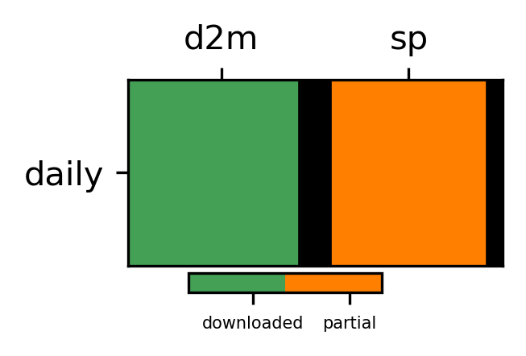

## derived-era5-single-levels-daily-statistics catalogue

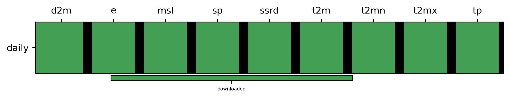

## derived-utci-historical catalogue

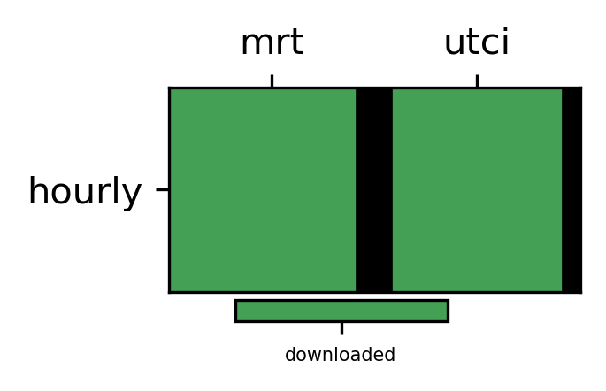

## insitu-gridded-observations-europe catalogue

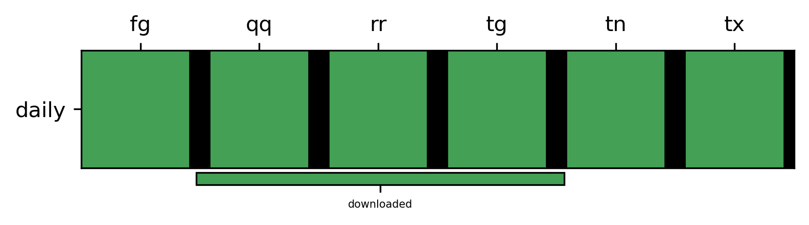

## reanalysis-cerra-land catalogue

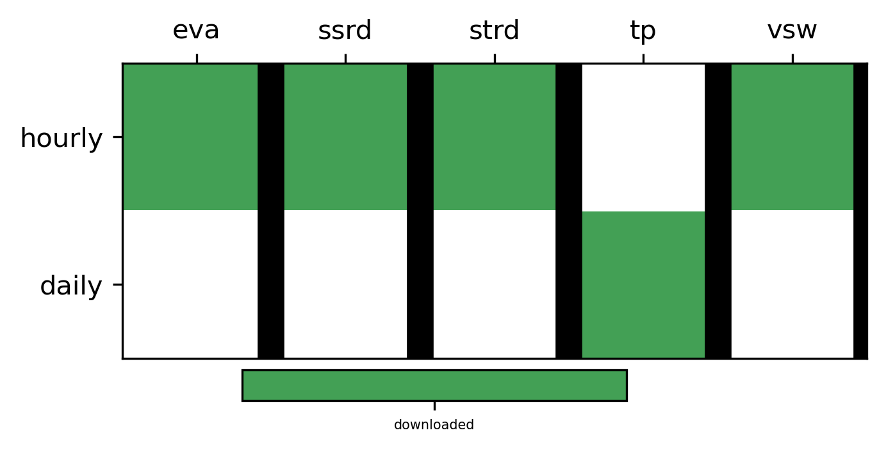

## reanalysis-cerra-single-levels catalogue

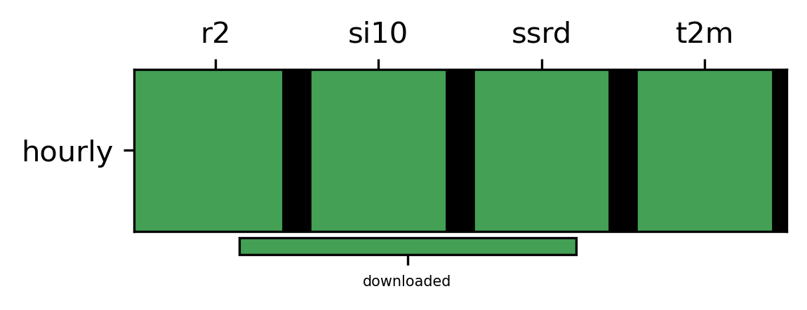

## reanalysis-era5-single-levels catalogue

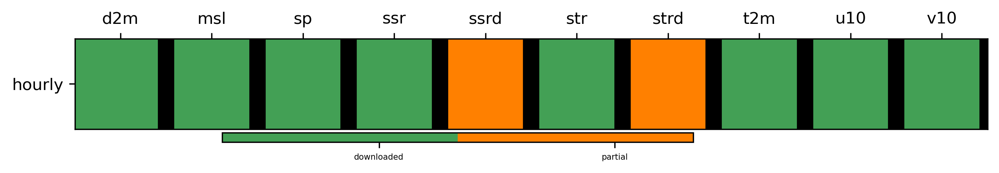

## reanalysis-oras5 catalogue

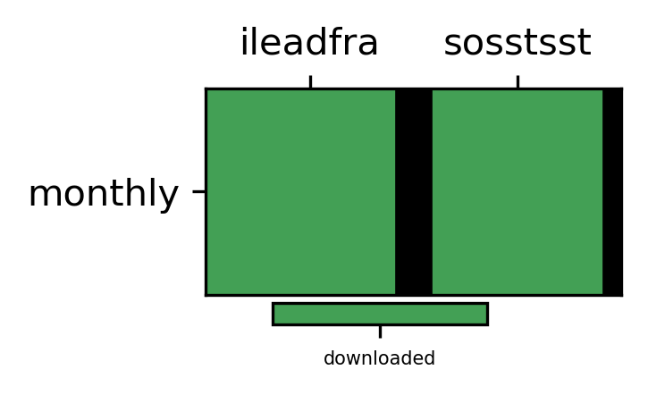

## reanalysis-pan-carra-means catalogue

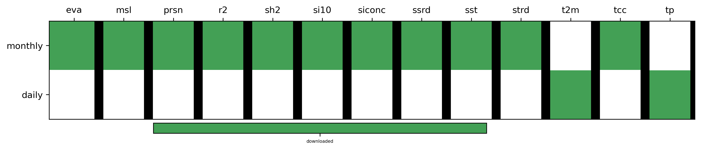

## satellite-sea-ice-concentration catalogue

Catalogue image not available yet.

## satellite-sea-ice-concentration nh catalogue

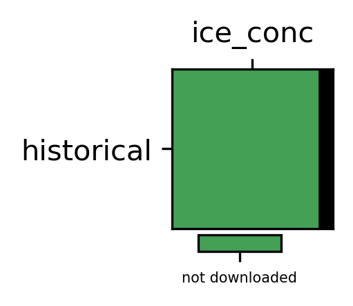

## satellite-sea-ice-concentration sh catalogue

## satellite-sea-level-global catalogue

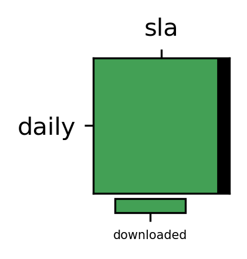

## satellite-sea-surface-temperature catalogue

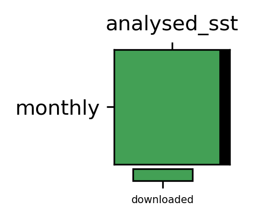

## satellite-soil-moisture catalogue

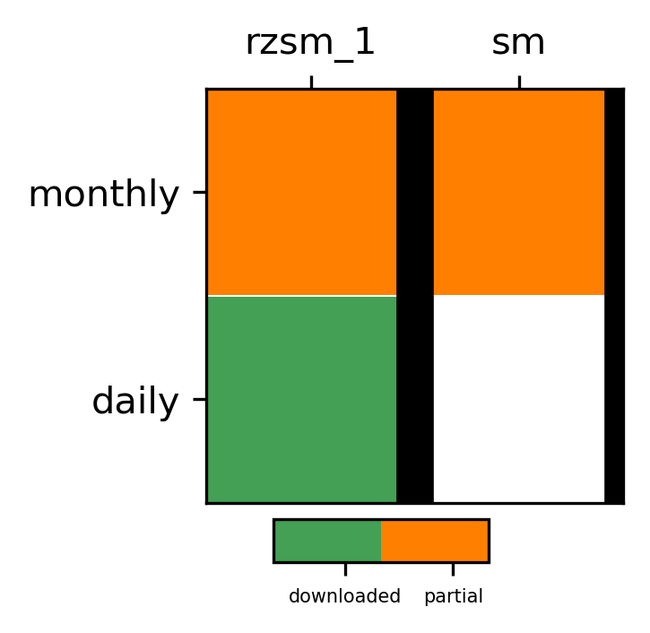

## satellite-surface-radiation-budget catalogue

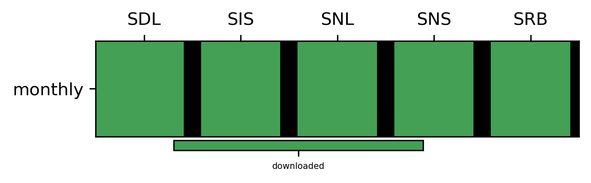

## All Catalogues Table

| variable     |   model | experiment   | dataset                                     | dataset_type   | product_type   | temporal_resolution   | interpolation   | data_path                                                                                                               | origin_path                                                                                                                                                                                                                                                                                                                                                                                                                  | start_file_exists   | final_file_exists   |    earliest_date |      latest_date | script                                                          |
|:-------------|--------:|:-------------|:--------------------------------------------|:---------------|:---------------|:----------------------|:----------------|:------------------------------------------------------------------------------------------------------------------------|:-----------------------------------------------------------------------------------------------------------------------------------------------------------------------------------------------------------------------------------------------------------------------------------------------------------------------------------------------------------------------------------------------------------------------------|:--------------------|:--------------------|-----------------:|-----------------:|:----------------------------------------------------------------|
| sosstsst     |     nan | historical   | reanalysis-oras5                            | reanalysis     | raw            | monthly               | native          | /lustre/gmeteo/WORK/DATA/C3S-CDS/CDS-Curated-Data/raw/reanalysis-oras5/monthly/native/sosstsst                          | CDS                                                                                                                                                                                                                                                                                                                                                                                                                          | True                | True                | 195801           | 202512           | scripts/download/reanalysis-oras5.py                            |
| ileadfra     |     nan | historical   | reanalysis-oras5                            | reanalysis     | raw            | monthly               | native          | /lustre/gmeteo/WORK/DATA/C3S-CDS/CDS-Curated-Data/raw/reanalysis-oras5/monthly/native/ileadfra                          | CDS                                                                                                                                                                                                                                                                                                                                                                                                                          | True                | True                | 195801           | 202512           | scripts/download/reanalysis-oras5.py                            |
| sosstsst     |     nan | historical   | reanalysis-oras5                            | reanalysis     | raw            | monthly               | native          | /lustre/gmeteo/WORK/DATA/C3S-CDS/CDS-Curated-Data/raw/reanalysis-oras5/monthly/native/sosstsst                          | CDS                                                                                                                                                                                                                                                                                                                                                                                                                          | True                | True                | 195801           | 202512           | scripts/download/reanalysis-oras5.py                            |
| ileadfra     |     nan | historical   | reanalysis-oras5                            | reanalysis     | raw            | monthly               | native          | /lustre/gmeteo/WORK/DATA/C3S-CDS/CDS-Curated-Data/raw/reanalysis-oras5/monthly/native/ileadfra                          | CDS                                                                                                                                                                                                                                                                                                                                                                                                                          | True                | True                | 195801           | 202512           | scripts/download/reanalysis-oras5.py                            |
| d2m          |     nan | historical   | derived-era5-land-daily-statistics          | reanalysis     | raw            | daily                 | native          | /lustre/gmeteo/WORK/DATA/C3S-CDS/CDS-Curated-Data/raw/derived-era5-land-daily-statistics/daily/native/d2m               | CDS                                                                                                                                                                                                                                                                                                                                                                                                                          | True                | False               |   1950           |   1968           | scripts/download/derived-era5-land-daily-statistics.py          |
| sp           |     nan | historical   | derived-era5-land-daily-statistics          | reanalysis     | raw            | daily                 | native          | /lustre/gmeteo/WORK/DATA/C3S-CDS/CDS-Curated-Data/raw/derived-era5-land-daily-statistics/daily/native/sp                | CDS                                                                                                                                                                                                                                                                                                                                                                                                                          | False               | False               |    nan           |    nan           | scripts/download/derived-era5-land-daily-statistics.py          |
| ice_conc     |     nan | historical   | satellite-sea-ice-concentration             | observations   | raw            | daily                 | native          | /lustre/gmeteo/WORK/DATA/C3S-CDS/CDS-Curated-Data/raw/satellite-sea-ice-concentration_sh/daily/native/ice_conc          | CDS                                                                                                                                                                                                                                                                                                                                                                                                                          | True                | True                |      1.9781e+07  |      2.02509e+07 | scripts/download/satellite-sea-ice-concentration.py             |
| ice_conc     |     nan | historical   | satellite-sea-ice-concentration             | observations   | raw            | monthly               | native          | /lustre/gmeteo/WORK/DATA/C3S-CDS/CDS-Curated-Data/raw/satellite-sea-ice-concentration_sh/monthly/native/ice_conc        | CDS                                                                                                                                                                                                                                                                                                                                                                                                                          | True                | True                | 197810           | 202508           | scripts/download/satellite-sea-ice-concentration.py             |
| sfcwind      |     nan | historical   | reanalysis-era5-single-levels               | reanalysis     | derived        | daily                 | native          | /lustre/gmeteo/WORK/DATA/C3S-CDS/CDS-Curated-Data/derived/reanalysis-era5-single-levels/daily/native/sfcwind            | /lustre/gmeteo/WORK/DATA/C3S-CDS/CDS-Curated-Data/raw/reanalysis-era5-single-levels/daily/native/u10;/lustre/gmeteo/WORK/DATA/C3S-CDS/CDS-Curated-Data/raw/reanalysis-era5-single-levels/daily/native/v10                                                                                                                                                                                                                    | True                | True                |   1940           |   2024           | scripts/derived/reanalysis-era5-single-levels.py                |
| sfcwind      |     nan | historical   | reanalysis-era5-single-levels               | reanalysis     | derived        | hourly                | native          | /lustre/gmeteo/WORK/DATA/C3S-CDS/CDS-Curated-Data/derived/reanalysis-era5-single-levels/hourly/native/sfcwind           | /lustre/gmeteo/WORK/DATA/C3S-CDS/CDS-Curated-Data/raw/reanalysis-era5-single-levels/hourly/native/u10;/lustre/gmeteo/WORK/DATA/C3S-CDS/CDS-Curated-Data/raw/reanalysis-era5-single-levels/hourly/native/v10                                                                                                                                                                                                                  | True                | True                | 194001           | 202412           | scripts/derived/reanalysis-era5-single-levels.py                |
| hurs         |     nan | historical   | reanalysis-era5-single-levels               | reanalysis     | derived        | hourly                | native          | /lustre/gmeteo/WORK/DATA/C3S-CDS/CDS-Curated-Data/derived/reanalysis-era5-single-levels/hourly/native/hurs              | /lustre/gmeteo/WORK/DATA/C3S-CDS/CDS-Curated-Data/raw/reanalysis-era5-single-levels/hourly/native/d2m;/lustre/gmeteo/WORK/DATA/C3S-CDS/CDS-Curated-Data/raw/reanalysis-era5-single-levels/hourly/native/t2m                                                                                                                                                                                                                  | True                | True                | 194001           | 202412           | scripts/derived/reanalysis-era5-single-levels.py                |
| sfcwind      |     nan | historical   | reanalysis-era5-single-levels               | reanalysis     | derived        | daily                 | gr100           | /lustre/gmeteo/PTICLIMA/DATA/REANALYSIS/ERA5/data_derived/medcof_1degree/day/sfcwind                                    | /lustre/gmeteo/WORK/DATA/C3S-CDS/CDS-Curated-Data/derived/reanalysis-era5-single-levels/daily/native/sfcwind                                                                                                                                                                                                                                                                                                                 | True                | True                |   1940           |   2024           | scripts/interpolation/era5-single-levels-daily-Medcof.py        |
| rsus         |     nan | historical   | reanalysis-era5-single-levels               | reanalysis     | derived        | hourly                | native          | /lustre/gmeteo/WORK/DATA/C3S-CDS/CDS-Curated-Data/derived/reanalysis-era5-single-levels/hourly/native/rsus              | /lustre/gmeteo/WORK/DATA/C3S-CDS/CDS-Curated-Data/raw/reanalysis-era5-single-levels/hourly/native/rsds;/lustre/gmeteo/WORK/DATA/C3S-CDS/CDS-Curated-Data/raw/reanalysis-era5-single-levels/hourly/native/rsns                                                                                                                                                                                                                | False               | True                | 200001           | 202412           | scripts/derived/reanalysis-era5-single-levels.py                |
| rlus         |     nan | historical   | reanalysis-era5-single-levels               | reanalysis     | derived        | hourly                | native          | /lustre/gmeteo/WORK/DATA/C3S-CDS/CDS-Curated-Data/derived/reanalysis-era5-single-levels/hourly/native/rlus              | /lustre/gmeteo/WORK/DATA/C3S-CDS/CDS-Curated-Data/raw/reanalysis-era5-single-levels/hourly/native/rlds;/lustre/gmeteo/WORK/DATA/C3S-CDS/CDS-Curated-Data/raw/reanalysis-era5-single-levels/hourly/native/rlns                                                                                                                                                                                                                | False               | True                | 200001           | 202412           | scripts/derived/reanalysis-era5-single-levels.py                |
| mrt          |     nan | historical   | reanalysis-era5-single-levels               | reanalysis     | derived        | hourly                | native          | /lustre/gmeteo/WORK/DATA/C3S-CDS/CDS-Curated-Data/derived/reanalysis-era5-single-levels/hourly/native/mrt               | /lustre/gmeteo/WORK/DATA/C3S-CDS/CDS-Curated-Data/raw/reanalysis-era5-single-levels/hourly/native/rsus;/lustre/gmeteo/WORK/DATA/C3S-CDS/CDS-Curated-Data/raw/reanalysis-era5-single-levels/hourly/native/rlus;/lustre/gmeteo/WORK/DATA/C3S-CDS/CDS-Curated-Data/raw/reanalysis-era5-single-levels/hourly/native/rsds;/lustre/gmeteo/WORK/DATA/C3S-CDS/CDS-Curated-Data/raw/reanalysis-era5-single-levels/hourly/native/rlds  | False               | True                | 200001           | 202412           | scripts/derived/reanalysis-era5-single-levels.py                |
| utci         |     nan | historical   | reanalysis-era5-single-levels               | reanalysis     | derived        | hourly                | native          | /lustre/gmeteo/WORK/DATA/C3S-CDS/CDS-Curated-Data/derived/reanalysis-era5-single-levels/hourly/native/utci              | /lustre/gmeteo/WORK/DATA/C3S-CDS/CDS-Curated-Data/raw/reanalysis-era5-single-levels/hourly/native/t2m;/lustre/gmeteo/WORK/DATA/C3S-CDS/CDS-Curated-Data/raw/reanalysis-era5-single-levels/hourly/native/sfcwind;/lustre/gmeteo/WORK/DATA/C3S-CDS/CDS-Curated-Data/raw/reanalysis-era5-single-levels/hourly/native/hurs;/lustre/gmeteo/WORK/DATA/C3S-CDS/CDS-Curated-Data/raw/reanalysis-era5-single-levels/hourly/native/mrt | False               | False               | 200001           | 202012           | scripts/derived/reanalysis-era5-single-levels.py                |
| u10          |     nan | historical   | reanalysis-era5-single-levels               | reanalysis     | raw            | hourly                | native          | /lustre/gmeteo/WORK/DATA/C3S-CDS/CDS-Curated-Data/raw/reanalysis-era5-single-levels/hourly/native/u10                   | CDS                                                                                                                                                                                                                                                                                                                                                                                                                          | True                | True                |   1940           |   2024           | scripts/download/reanalysis-era5-single-levels.py               |
| v10          |     nan | historical   | reanalysis-era5-single-levels               | reanalysis     | raw            | hourly                | native          | /lustre/gmeteo/WORK/DATA/C3S-CDS/CDS-Curated-Data/raw/reanalysis-era5-single-levels/hourly/native/v10                   | CDS                                                                                                                                                                                                                                                                                                                                                                                                                          | True                | True                |   1940           |   2024           | scripts/download/reanalysis-era5-single-levels.py               |
| d2m          |     nan | historical   | reanalysis-era5-single-levels               | reanalysis     | raw            | hourly                | native          | /lustre/gmeteo/WORK/DATA/C3S-CDS/CDS-Curated-Data/raw/reanalysis-era5-single-levels/hourly/native/d2m                   | CDS                                                                                                                                                                                                                                                                                                                                                                                                                          | True                | True                |   1940           |   2024           | scripts/derived/reanalysis-era5-single-levels.py                |
| sp           |     nan | historical   | reanalysis-era5-single-levels               | reanalysis     | raw            | hourly                | native          | /lustre/gmeteo/WORK/DATA/C3S-CDS/CDS-Curated-Data/raw/reanalysis-era5-single-levels/hourly/native/sp                    | CDS                                                                                                                                                                                                                                                                                                                                                                                                                          | True                | True                |   1940           |   2024           | scripts/derived/reanalysis-era5-single-levels.py                |
| msl          |     nan | historical   | reanalysis-era5-single-levels               | reanalysis     | raw            | hourly                | native          | /lustre/gmeteo/WORK/DATA/C3S-CDS/CDS-Curated-Data/raw/reanalysis-era5-single-levels/hourly/native/msl                   | CDS                                                                                                                                                                                                                                                                                                                                                                                                                          | True                | True                |   1940           |   2024           | scripts/derived/reanalysis-era5-single-levels.py                |
| t2m          |     nan | historical   | reanalysis-era5-single-levels               | reanalysis     | raw            | hourly                | native          | /lustre/gmeteo/WORK/DATA/C3S-CDS/CDS-Curated-Data/raw/reanalysis-era5-single-levels/hourly/native/t2m                   | CDS                                                                                                                                                                                                                                                                                                                                                                                                                          | True                | True                |   1940           |   2024           | scripts/derived/reanalysis-era5-single-levels.py                |
| ssr          |     nan | historical   | reanalysis-era5-single-levels               | reanalysis     | raw            | hourly                | native          | /lustre/gmeteo/WORK/DATA/C3S-CDS/CDS-Curated-Data/raw/reanalysis-era5-single-levels/hourly/native/ssr                   | /lustre/gmeteo/WORK/DATA/C3S-CDS/CDS-Curated-Data/raw/reanalysis-era5-single-levels/hourly/native/ssr                                                                                                                                                                                                                                                                                                                        | True                | True                |   1940           |   2024           | scripts/download/reanalysis-era5-single-levels.py               |
| str          |     nan | historical   | reanalysis-era5-single-levels               | reanalysis     | raw            | hourly                | native          | /lustre/gmeteo/WORK/DATA/C3S-CDS/CDS-Curated-Data/raw/reanalysis-era5-single-levels/hourly/native/str                   | /lustre/gmeteo/WORK/DATA/C3S-CDS/CDS-Curated-Data/raw/reanalysis-era5-single-levels/hourly/native/str                                                                                                                                                                                                                                                                                                                        | True                | True                |   1940           |   2024           | scripts/download/reanalysis-era5-single-levels.py               |
| ssrd         |     nan | historical   | reanalysis-era5-single-levels               | reanalysis     | raw            | hourly                | native          | /lustre/gmeteo/WORK/DATA/C3S-CDS/CDS-Curated-Data/raw/reanalysis-era5-single-levels/hourly/native/ssrd                  | /lustre/gmeteo/WORK/DATA/C3S-CDS/CDS-Curated-Data/raw/reanalysis-era5-single-levels/hourly/native/ssrd                                                                                                                                                                                                                                                                                                                       | False               | True                |   2000           |   2024           | scripts/download/reanalysis-era5-single-levels.py               |
| strd         |     nan | historical   | reanalysis-era5-single-levels               | reanalysis     | raw            | hourly                | native          | /lustre/gmeteo/WORK/DATA/C3S-CDS/CDS-Curated-Data/raw/reanalysis-era5-single-levels/hourly/native/strd                  | /lustre/gmeteo/WORK/DATA/C3S-CDS/CDS-Curated-Data/raw/reanalysis-era5-single-levels/hourly/native/strd                                                                                                                                                                                                                                                                                                                       | False               | True                |   2000           |   2024           | scripts/download/reanalysis-era5-single-levels.py               |
| ice_conc     |     nan | historical   | satellite-sea-ice-concentration             | observations   | derived        | daily                 | gr025           | /lustre/gmeteo/WORK/DATA/C3S-CDS/CDS-Curated-Data/derived/satellite-sea-ice-concentration_sh/daily/gr025/ice_conc       | CDS                                                                                                                                                                                                                                                                                                                                                                                                                          | True                | False               |      1.9781e+07  |      1.99004e+07 | scripts/download/satellite-sea-ice-concentration.py             |
| ice_conc     |     nan | historical   | satellite-sea-ice-concentration             | observations   | derived        | monthly               | gr025           | /lustre/gmeteo/WORK/DATA/C3S-CDS/CDS-Curated-Data/derived/satellite-sea-ice-concentration_sh/monthly/gr025/ice_conc     | CDS                                                                                                                                                                                                                                                                                                                                                                                                                          | True                | True                | 197810           | 202508           | scripts/download/satellite-sea-ice-concentration.py             |
| ice_conc     |     nan | historical   | satellite-sea-ice-concentration             | observations   | derived        | daily                 | gr025           | /lustre/gmeteo/WORK/DATA/C3S-CDS/CDS-Curated-Data/derived/satellite-sea-ice-concentration_nh/daily/gr025/ice_conc       | CDS                                                                                                                                                                                                                                                                                                                                                                                                                          | True                | True                |      1.9781e+07  |      2.02509e+07 | scripts/download/satellite-sea-ice-concentration.py             |
| ice_conc     |     nan | historical   | satellite-sea-ice-concentration             | observations   | derived        | monthly               | gr025           | /lustre/gmeteo/WORK/DATA/C3S-CDS/CDS-Curated-Data/derived/satellite-sea-ice-concentration_nh/monthly/gr025/ice_conc     | CDS                                                                                                                                                                                                                                                                                                                                                                                                                          | True                | True                | 197810           | 202508           | scripts/download/satellite-sea-ice-concentration.py             |
| ice_conc     |     nan | historical   | satellite-sea-ice-concentration             | observations   | raw            | daily                 | native          | /lustre/gmeteo/WORK/DATA/C3S-CDS/CDS-Curated-Data/raw/satellite-sea-ice-concentration_nh/daily/native/ice_conc          | CDS                                                                                                                                                                                                                                                                                                                                                                                                                          | True                | True                |      1.9781e+07  |      2.02509e+07 | scripts/download/satellite-sea-ice-concentration.py             |
| ice_conc     |     nan | historical   | satellite-sea-ice-concentration             | observations   | raw            | monthly               | native          | /lustre/gmeteo/WORK/DATA/C3S-CDS/CDS-Curated-Data/raw/satellite-sea-ice-concentration_nh/monthly/native/ice_conc        | CDS                                                                                                                                                                                                                                                                                                                                                                                                                          | True                | True                | 197810           | 202508           | scripts/download/satellite-sea-ice-concentration.py             |
| si10         |     nan | historical   | reanalysis-pan-carra-means                  | reanalysis     | raw            | monthly               | native          | /lustre/gmeteo/WORK/DATA/C3S-CDS/CDS-Curated-Data/raw/reanalysis-pan-carra-means/monthly/native/si10                    | CDS                                                                                                                                                                                                                                                                                                                                                                                                                          | True                | True                | 198601           | 202512           | scripts/download/reanalysis-pan-carra-means.py                  |
| r2           |     nan | historical   | reanalysis-pan-carra-means                  | reanalysis     | raw            | monthly               | native          | /lustre/gmeteo/WORK/DATA/C3S-CDS/CDS-Curated-Data/raw/reanalysis-pan-carra-means/monthly/native/r2                      | CDS                                                                                                                                                                                                                                                                                                                                                                                                                          | True                | True                | 198601           | 202512           | scripts/download/reanalysis-pan-carra-means.py                  |
| sh2          |     nan | historical   | reanalysis-pan-carra-means                  | reanalysis     | raw            | monthly               | native          | /lustre/gmeteo/WORK/DATA/C3S-CDS/CDS-Curated-Data/raw/reanalysis-pan-carra-means/monthly/native/sh2                     | CDS                                                                                                                                                                                                                                                                                                                                                                                                                          | True                | True                | 198601           | 202512           | scripts/download/reanalysis-pan-carra-means.py                  |
| msl          |     nan | historical   | reanalysis-pan-carra-means                  | reanalysis     | raw            | monthly               | native          | /lustre/gmeteo/WORK/DATA/C3S-CDS/CDS-Curated-Data/raw/reanalysis-pan-carra-means/monthly/native/msl                     | CDS                                                                                                                                                                                                                                                                                                                                                                                                                          | True                | True                | 198601           | 202512           | scripts/download/reanalysis-pan-carra-means.py                  |
| siconc       |     nan | historical   | reanalysis-pan-carra-means                  | reanalysis     | raw            | monthly               | native          | /lustre/gmeteo/WORK/DATA/C3S-CDS/CDS-Curated-Data/raw/reanalysis-pan-carra-means/monthly/native/siconc                  | CDS                                                                                                                                                                                                                                                                                                                                                                                                                          | True                | True                | 198601           | 202512           | scripts/download/reanalysis-pan-carra-means.py                  |
| sst          |     nan | historical   | reanalysis-pan-carra-means                  | reanalysis     | raw            | monthly               | native          | /lustre/gmeteo/WORK/DATA/C3S-CDS/CDS-Curated-Data/raw/reanalysis-pan-carra-means/monthly/native/sst                     | CDS                                                                                                                                                                                                                                                                                                                                                                                                                          | True                | True                | 198601           | 202512           | scripts/download/reanalysis-pan-carra-means.py                  |
| eva          |     nan | historical   | reanalysis-pan-carra-means                  | reanalysis     | raw            | monthly               | native          | /lustre/gmeteo/WORK/DATA/C3S-CDS/CDS-Curated-Data/raw/reanalysis-pan-carra-means/monthly/native/eva                     | CDS                                                                                                                                                                                                                                                                                                                                                                                                                          | True                | True                | 198601           | 202512           | scripts/download/reanalysis-pan-carra-means.py                  |
| ssrd         |     nan | historical   | reanalysis-pan-carra-means                  | reanalysis     | raw            | monthly               | native          | /lustre/gmeteo/WORK/DATA/C3S-CDS/CDS-Curated-Data/raw/reanalysis-pan-carra-means/monthly/native/ssrd                    | CDS                                                                                                                                                                                                                                                                                                                                                                                                                          | True                | True                | 198601           | 202512           | scripts/download/reanalysis-pan-carra-means.py                  |
| strd         |     nan | historical   | reanalysis-pan-carra-means                  | reanalysis     | raw            | monthly               | native          | /lustre/gmeteo/WORK/DATA/C3S-CDS/CDS-Curated-Data/raw/reanalysis-pan-carra-means/monthly/native/strd                    | CDS                                                                                                                                                                                                                                                                                                                                                                                                                          | True                | True                | 198601           | 202512           | scripts/download/reanalysis-pan-carra-means.py                  |
| tcc          |     nan | historical   | reanalysis-pan-carra-means                  | reanalysis     | raw            | monthly               | native          | /lustre/gmeteo/WORK/DATA/C3S-CDS/CDS-Curated-Data/raw/reanalysis-pan-carra-means/monthly/native/tcc                     | CDS                                                                                                                                                                                                                                                                                                                                                                                                                          | True                | True                | 198601           | 202512           | scripts/download/reanalysis-pan-carra-means.py                  |
| prsn         |     nan | historical   | reanalysis-pan-carra-means                  | reanalysis     | raw            | monthly               | native          | /lustre/gmeteo/WORK/DATA/C3S-CDS/CDS-Curated-Data/raw/reanalysis-pan-carra-means/monthly/native/prsn                    | CDS                                                                                                                                                                                                                                                                                                                                                                                                                          | True                | True                | 198601           | 202512           | scripts/download/reanalysis-pan-carra-means.py                  |
| tp           |     nan | historical   | reanalysis-pan-carra-means                  | reanalysis     | raw            | daily                 | native          | /lustre/gmeteo/WORK/DATA/C3S-CDS/CDS-Curated-Data/raw/reanalysis-pan-carra-means/daily/native/tp                        | CDS                                                                                                                                                                                                                                                                                                                                                                                                                          | True                | True                | 198601           | 202512           | scripts/download/reanalysis-pan-carra-means.py                  |
| t2m          |     nan | historical   | reanalysis-pan-carra-means                  | reanalysis     | raw            | daily                 | native          | /lustre/gmeteo/WORK/DATA/C3S-CDS/CDS-Curated-Data/raw/reanalysis-pan-carra-means/daily/native/t2m                       | CDS                                                                                                                                                                                                                                                                                                                                                                                                                          | True                | True                | 198601           | 202512           | scripts/download/reanalysis-pan-carra-means.py                  |
| t2m          |     nan | historical   | reanalysis-cerra-single-levels              | reanalysis     | raw            | hourly                | native          | /lustre/gmeteo/WORK/DATA/C3S-CDS/CDS-Curated-Data/raw/reanalysis-cerra-single-levels/hourly/native/t2m                  | CDS                                                                                                                                                                                                                                                                                                                                                                                                                          | True                | True                | 198801           | 201712           | scripts/download/reanalysis-cerra-single-levels.py              |
| r2           |     nan | historical   | reanalysis-cerra-single-levels              | reanalysis     | raw            | hourly                | native          | /lustre/gmeteo/WORK/DATA/C3S-CDS/CDS-Curated-Data/raw/reanalysis-cerra-single-levels/hourly/native/r2                   | CDS                                                                                                                                                                                                                                                                                                                                                                                                                          | True                | True                | 198801           | 201712           | scripts/download/reanalysis-cerra-single-levels.py              |
| si10         |     nan | historical   | reanalysis-cerra-single-levels              | reanalysis     | raw            | hourly                | native          | /lustre/gmeteo/WORK/DATA/C3S-CDS/CDS-Curated-Data/raw/reanalysis-cerra-single-levels/hourly/native/si10                 | CDS                                                                                                                                                                                                                                                                                                                                                                                                                          | True                | True                | 198801           | 201712           | scripts/download/reanalysis-cerra-single-levels.py              |
| ssrd         |     nan | historical   | reanalysis-cerra-single-levels              | reanalysis     | raw            | hourly                | native          | /lustre/gmeteo/WORK/DATA/C3S-CDS/CDS-Curated-Data/raw/reanalysis-cerra-single-levels/hourly/native/ssrd                 | CDS                                                                                                                                                                                                                                                                                                                                                                                                                          | True                | True                | 198801           | 201712           | scripts/download/reanalysis-cerra-single-levels.py              |
| eva          |     nan | historical   | reanalysis-cerra-land                       | reanalysis     | derived        | daily                 | native          | /lustre/gmeteo/WORK/DATA/C3S-CDS/CDS-Curated-Data/derived/reanalysis-cerra-land/daily/native/eva                        | /lustre/gmeteo/WORK/DATA/C3S-CDS/CDS-Curated-Data/raw/reanalysis-cerra-land/daily/native/eva                                                                                                                                                                                                                                                                                                                                 | True                | False               | 198501           | 202108           | scripts/derived/reanalysis-cerra-land_accumulation.py           |
| ssrd         |     nan | historical   | reanalysis-cerra-land                       | reanalysis     | derived        | daily                 | native          | /lustre/gmeteo/WORK/DATA/C3S-CDS/CDS-Curated-Data/derived/reanalysis-cerra-land/daily/native/ssrd                       | /lustre/gmeteo/WORK/DATA/C3S-CDS/CDS-Curated-Data/raw/reanalysis-cerra-land/daily/native/ssrd                                                                                                                                                                                                                                                                                                                                | True                | False               | 198501           | 202012           | scripts/derived/reanalysis-cerra-land_accumulation.py           |
| strd         |     nan | historical   | reanalysis-cerra-land                       | reanalysis     | derived        | daily                 | native          | /lustre/gmeteo/WORK/DATA/C3S-CDS/CDS-Curated-Data/derived/reanalysis-cerra-land/daily/native/strd                       | /lustre/gmeteo/WORK/DATA/C3S-CDS/CDS-Curated-Data/raw/reanalysis-cerra-land/daily/native/strd                                                                                                                                                                                                                                                                                                                                | True                | False               | 198501           | 202012           | scripts/derived/reanalysis-cerra-land_accumulation.py           |
| tp           |     nan | historical   | reanalysis-cerra-land                       | reanalysis     | raw            | daily                 | native          | /lustre/gmeteo/WORK/DATA/C3S-CDS/CDS-Curated-Data/raw/reanalysis-cerra-land/daily/native/tp                             | CDS                                                                                                                                                                                                                                                                                                                                                                                                                          | True                | True                | 198408           | 202507           | scripts/download/reanalysis-cerra-land-single-levels.py         |
| eva          |     nan | historical   | reanalysis-cerra-land                       | reanalysis     | raw            | hourly                | native          | /lustre/gmeteo/WORK/DATA/C3S-CDS/CDS-Curated-Data/raw/reanalysis-cerra-land/hourly/native/eva                           | CDS                                                                                                                                                                                                                                                                                                                                                                                                                          | True                | True                | 198501           | 202507           | scripts/download/reanalysis-cerra-land-single-levels.py         |
| ssrd         |     nan | historical   | reanalysis-cerra-land                       | reanalysis     | raw            | hourly                | native          | /lustre/gmeteo/WORK/DATA/C3S-CDS/CDS-Curated-Data/raw/reanalysis-cerra-land/hourly/native/ssrd                          | CDS                                                                                                                                                                                                                                                                                                                                                                                                                          | True                | False               | 198501           | 202412           | scripts/download/reanalysis-cerra-land-single-levels.py         |
| strd         |     nan | historical   | reanalysis-cerra-land                       | reanalysis     | raw            | hourly                | native          | /lustre/gmeteo/WORK/DATA/C3S-CDS/CDS-Curated-Data/raw/reanalysis-cerra-land/hourly/native/strd                          | CDS                                                                                                                                                                                                                                                                                                                                                                                                                          | True                | False               | 198501           | 202412           | scripts/download/reanalysis-cerra-land-single-levels.py         |
| vsw          |     nan | historical   | reanalysis-cerra-land                       | reanalysis     | raw            | hourly                | native          | /lustre/gmeteo/WORK/DATA/C3S-CDS/CDS-Curated-Data/raw/reanalysis-cerra-land/hourly/native/vsw                           | CDS                                                                                                                                                                                                                                                                                                                                                                                                                          | True                | False               | 198501           | 202412           | scripts/download/reanalysis-cerra-land-single-levels.py         |
| utci         |     nan | historical   | derived-utci-historical                     | reanalysis     | raw            | hourly                | native          | /lustre/gmeteo/WORK/DATA/C3S-CDS/CDS-Curated-Data/raw/derived-utci-historical/hourly/native/utci                        | CDS                                                                                                                                                                                                                                                                                                                                                                                                                          | True                | True                |      2.00001e+07 |      2.02001e+07 | scripts/download/derived-utci-historical.py                     |
| mrt          |     nan | historical   | derived-utci-historical                     | reanalysis     | raw            | hourly                | native          | /lustre/gmeteo/WORK/DATA/C3S-CDS/CDS-Curated-Data/raw/derived-utci-historical/hourly/native/mrt                         | CDS                                                                                                                                                                                                                                                                                                                                                                                                                          | True                | True                |      2.00001e+07 |      2.02012e+07 | scripts/download/derived-utci-historical.py                     |
| t2m          |     nan | historical   | derived-era5-single-levels-daily-statistics | reanalysis     | raw            | daily                 | native          | /lustre/gmeteo/WORK/DATA/C3S-CDS/CDS-Curated-Data/raw/derived-era5-single-levels-daily-statistics/daily/native/t2m      | CDS                                                                                                                                                                                                                                                                                                                                                                                                                          | True                | True                |   1940           |   2024           | scripts/download/derived-era5-single-levels-daily-statistics.py |
| t2mx         |     nan | historical   | derived-era5-single-levels-daily-statistics | reanalysis     | raw            | daily                 | native          | /lustre/gmeteo/WORK/DATA/C3S-CDS/CDS-Curated-Data/raw/derived-era5-single-levels-daily-statistics/daily/native/t2mx     | CDS                                                                                                                                                                                                                                                                                                                                                                                                                          | True                | True                |   1940           |   2024           | scripts/download/derived-era5-single-levels-daily-statistics.py |
| t2mn         |     nan | historical   | derived-era5-single-levels-daily-statistics | reanalysis     | raw            | daily                 | native          | /lustre/gmeteo/WORK/DATA/C3S-CDS/CDS-Curated-Data/raw/derived-era5-single-levels-daily-statistics/daily/native/t2mn     | CDS                                                                                                                                                                                                                                                                                                                                                                                                                          | True                | True                |   1940           |   2024           | scripts/download/derived-era5-single-levels-daily-statistics.py |
| tp           |     nan | historical   | derived-era5-single-levels-daily-statistics | reanalysis     | raw            | daily                 | native          | /lustre/gmeteo/WORK/DATA/C3S-CDS/CDS-Curated-Data/raw/derived-era5-single-levels-daily-statistics/daily/native/tp       | CDS                                                                                                                                                                                                                                                                                                                                                                                                                          | True                | True                |   1940           |   2024           | scripts/download/derived-era5-single-levels-daily-statistics.py |
| e            |     nan | historical   | derived-era5-single-levels-daily-statistics | reanalysis     | raw            | daily                 | native          | /lustre/gmeteo/WORK/DATA/C3S-CDS/CDS-Curated-Data/raw/derived-era5-single-levels-daily-statistics/daily/native/e        | CDS                                                                                                                                                                                                                                                                                                                                                                                                                          | True                | True                |   1940           |   2024           | scripts/download/derived-era5-single-levels-daily-statistics.py |
| d2m          |     nan | historical   | derived-era5-single-levels-daily-statistics | reanalysis     | raw            | daily                 | native          | /lustre/gmeteo/WORK/DATA/C3S-CDS/CDS-Curated-Data/raw/derived-era5-single-levels-daily-statistics/daily/native/d2m      | CDS                                                                                                                                                                                                                                                                                                                                                                                                                          | True                | True                |   1940           |   2024           | scripts/download/derived-era5-single-levels-daily-statistics.py |
| sp           |     nan | historical   | derived-era5-single-levels-daily-statistics | reanalysis     | raw            | daily                 | native          | /lustre/gmeteo/WORK/DATA/C3S-CDS/CDS-Curated-Data/raw/derived-era5-single-levels-daily-statistics/daily/native/sp       | CDS                                                                                                                                                                                                                                                                                                                                                                                                                          | True                | True                |   1940           |   2024           | scripts/download/derived-era5-single-levels-daily-statistics.py |
| msl          |     nan | historical   | derived-era5-single-levels-daily-statistics | reanalysis     | raw            | daily                 | native          | /lustre/gmeteo/WORK/DATA/C3S-CDS/CDS-Curated-Data/raw/derived-era5-single-levels-daily-statistics/daily/native/msl      | CDS                                                                                                                                                                                                                                                                                                                                                                                                                          | True                | True                |   1940           |   2024           | scripts/download/derived-era5-single-levels-daily-statistics.py |
| ssrd         |     nan | historical   | derived-era5-single-levels-daily-statistics | reanalysis     | raw            | daily                 | native          | /lustre/gmeteo/WORK/DATA/C3S-CDS/CDS-Curated-Data/raw/derived-era5-single-levels-daily-statistics/daily/native/ssrd     | CDS                                                                                                                                                                                                                                                                                                                                                                                                                          | True                | True                |   1940           |   2024           | scripts/download/derived-era5-single-levels-daily-statistics.py |
| SDL          |     nan | historical   | satellite-surface-radiation-budget          | observations   | raw            | monthly               | native          | /lustre/gmeteo/WORK/DATA/C3S-CDS/CDS-Curated-Data/raw/satellite-surface-radiation-budget/monthly/native/SDL             | CDS                                                                                                                                                                                                                                                                                                                                                                                                                          | True                | True                | 197901           | 202506           | scripts/download/satellite-surface-radiation-budget.py          |
| SIS          |     nan | historical   | satellite-surface-radiation-budget          | observations   | raw            | monthly               | native          | /lustre/gmeteo/WORK/DATA/C3S-CDS/CDS-Curated-Data/raw/satellite-surface-radiation-budget/monthly/native/SIS             | CDS                                                                                                                                                                                                                                                                                                                                                                                                                          | True                | True                | 197901           | 202506           | scripts/download/satellite-surface-radiation-budget.py          |
| SNL          |     nan | historical   | satellite-surface-radiation-budget          | observations   | raw            | monthly               | native          | /lustre/gmeteo/WORK/DATA/C3S-CDS/CDS-Curated-Data/raw/satellite-surface-radiation-budget/monthly/native/SNL             | CDS                                                                                                                                                                                                                                                                                                                                                                                                                          | True                | True                | 197901           | 202506           | scripts/download/satellite-surface-radiation-budget.py          |
| SNS          |     nan | historical   | satellite-surface-radiation-budget          | observations   | raw            | monthly               | native          | /lustre/gmeteo/WORK/DATA/C3S-CDS/CDS-Curated-Data/raw/satellite-surface-radiation-budget/monthly/native/SNS             | CDS                                                                                                                                                                                                                                                                                                                                                                                                                          | True                | True                | 197901           | 202506           | scripts/download/satellite-surface-radiation-budget.py          |
| SRB          |     nan | historical   | satellite-surface-radiation-budget          | observations   | raw            | monthly               | native          | /lustre/gmeteo/WORK/DATA/C3S-CDS/CDS-Curated-Data/raw/satellite-surface-radiation-budget/monthly/native/SRB             | CDS                                                                                                                                                                                                                                                                                                                                                                                                                          | True                | True                | 197901           | 202506           | scripts/download/satellite-surface-radiation-budget.py          |
| t2m          |     nan | historical   | reanalysis-cerra-single-levels              | reanalysis     | derived        | hourly                | gr006           | /lustre/gmeteo/WORK/DATA/C3S-CDS/CDS-Curated-Data/derived/reanalysis-cerra-single-levels/hourly/gr006/t2m               | /lustre/gmeteo/WORK/DATA/C3S-CDS/CDS-Curated-Data/raw/reanalysis-cerra-single-levels/hourly/native/t2m                                                                                                                                                                                                                                                                                                                       | True                | True                | 198801           | 201712           | scripts/interpolation/reanalysis-cerra-single-levels.py         |
| r2           |     nan | historical   | reanalysis-cerra-single-levels              | reanalysis     | derived        | hourly                | gr006           | /lustre/gmeteo/WORK/DATA/C3S-CDS/CDS-Curated-Data/derived/reanalysis-cerra-single-levels/hourly/gr006/r2                | /lustre/gmeteo/WORK/DATA/C3S-CDS/CDS-Curated-Data/raw/reanalysis-cerra-single-levels/hourly/native/r2                                                                                                                                                                                                                                                                                                                        | True                | True                | 198801           | 201712           | scripts/interpolation/reanalysis-cerra-single-levels.py         |
| si10         |     nan | historical   | reanalysis-cerra-single-levels              | reanalysis     | derived        | hourly                | gr006           | /lustre/gmeteo/WORK/DATA/C3S-CDS/CDS-Curated-Data/derived/reanalysis-cerra-single-levels/hourly/gr006/si10              | /lustre/gmeteo/WORK/DATA/C3S-CDS/CDS-Curated-Data/raw/reanalysis-cerra-single-levels/hourly/native/si10                                                                                                                                                                                                                                                                                                                      | True                | True                | 198801           | 201712           | scripts/interpolation/reanalysis-cerra-single-levels.py         |
| ssrd         |     nan | historical   | reanalysis-cerra-single-levels              | reanalysis     | derived        | hourly                | gr006           | /lustre/gmeteo/WORK/DATA/C3S-CDS/CDS-Curated-Data/derived/reanalysis-cerra-single-levels/hourly/gr006/ssrd              | /lustre/gmeteo/WORK/DATA/C3S-CDS/CDS-Curated-Data/raw/reanalysis-cerra-single-levels/hourly/native/ssrd                                                                                                                                                                                                                                                                                                                      | True                | True                | 198801           | 201712           | scripts/interpolation/reanalysis-cerra-single-levels.py         |
| analysed_sst |     nan | historical   | satellite-sea-surface-temperature           | observations   | raw            | monthly               | native          | /lustre/gmeteo/WORK/DATA/C3S-CDS/CDS-Curated-Data/raw/satellite-sea-surface-temperature/monthly/native/analysed_sst     | CDS                                                                                                                                                                                                                                                                                                                                                                                                                          | True                | True                | 198001           | 202512           | scripts/download/satellite-sea-surface-temperature.py           |
| rzsm_1       |     nan | historical   | satellite-soil-moisture                     | observations   | raw            | daily                 | native          | /lustre/gmeteo/WORK/DATA/C3S-CDS/CDS-Curated-Data/raw/satellite-soil-moisture/daily/native/rzsm_1                       | CDS                                                                                                                                                                                                                                                                                                                                                                                                                          | True                | True                |      1.98001e+07 |      2.02512e+07 | scripts/download/satellite-soil-moisture.py                     |
| rzsm_1       |     nan | historical   | satellite-soil-moisture                     | observations   | raw            | monthly               | native          | /lustre/gmeteo/WORK/DATA/C3S-CDS/CDS-Curated-Data/raw/satellite-soil-moisture/monthly/native/rzsm_1                     | CDS                                                                                                                                                                                                                                                                                                                                                                                                                          | True                | True                |      1.98001e+07 |      2.02512e+07 | scripts/download/satellite-soil-moisture.py                     |
| sm           |     nan | historical   | satellite-soil-moisture                     | observations   | raw            | monthly               | native          | /lustre/gmeteo/WORK/DATA/C3S-CDS/CDS-Curated-Data/raw/satellite-soil-moisture/monthly/native/sm                         | CDS                                                                                                                                                                                                                                                                                                                                                                                                                          | True                | True                |      1.98001e+07 |      2.02512e+07 | scripts/download/satellite-soil-moisture.py                     |
| sla          |     nan | historical   | satellite-sea-level-global                  | observation    | raw            | daily                 | native          | /lustre/gmeteo/WORK/DATA/C3S-CDS/CDS-Curated-Data/raw/satellite-sea-level-global/daily/native/sla                       | CDS                                                                                                                                                                                                                                                                                                                                                                                                                          | True                | True                |      1.99301e+07 |      2.02312e+07 | scripts/download/satellite-sea-level-global.py                  |
| tg           |     nan | historical   | insitu-gridded-observations-europe          | observation    | raw            | daily                 | native          | /lustre/gmeteo/WORK/DATA/C3S-CDS/CDS-Curated-Data/raw/insitu-gridded-observations-europe/daily/native/tg                | CDS                                                                                                                                                                                                                                                                                                                                                                                                                          | True                | True                |      1.9502e+07  |      1.9502e+07  | scripts/download/insitu-gridded-observations-europe.py          |
| tx           |     nan | historical   | insitu-gridded-observations-europe          | observation    | raw            | daily                 | native          | /lustre/gmeteo/WORK/DATA/C3S-CDS/CDS-Curated-Data/raw/insitu-gridded-observations-europe/daily/native/tx                | CDS                                                                                                                                                                                                                                                                                                                                                                                                                          | True                | True                |      1.9502e+07  |      1.9502e+07  | scripts/download/insitu-gridded-observations-europe.py          |
| tn           |     nan | historical   | insitu-gridded-observations-europe          | observation    | raw            | daily                 | native          | /lustre/gmeteo/WORK/DATA/C3S-CDS/CDS-Curated-Data/raw/insitu-gridded-observations-europe/daily/native/tn                | CDS                                                                                                                                                                                                                                                                                                                                                                                                                          | True                | True                |      1.9502e+07  |      1.9502e+07  | scripts/download/insitu-gridded-observations-europe.py          |
| fg           |     nan | historical   | insitu-gridded-observations-europe          | observation    | raw            | daily                 | native          | /lustre/gmeteo/WORK/DATA/C3S-CDS/CDS-Curated-Data/raw/insitu-gridded-observations-europe/daily/native/fg                | CDS                                                                                                                                                                                                                                                                                                                                                                                                                          | True                | True                |      1.9502e+07  |      1.9502e+07  | scripts/download/insitu-gridded-observations-europe.py          |
| rr           |     nan | historical   | insitu-gridded-observations-europe          | observation    | raw            | daily                 | native          | /lustre/gmeteo/WORK/DATA/C3S-CDS/CDS-Curated-Data/raw/insitu-gridded-observations-europe/daily/native/rr                | CDS                                                                                                                                                                                                                                                                                                                                                                                                                          | True                | True                |      1.9502e+07  |      1.9502e+07  | scripts/download/insitu-gridded-observations-europe.py          |
| qq           |     nan | historical   | insitu-gridded-observations-europe          | observation    | raw            | daily                 | native          | /lustre/gmeteo/WORK/DATA/C3S-CDS/CDS-Curated-Data/raw/insitu-gridded-observations-europe/daily/native/qq                | CDS                                                                                                                                                                                                                                                                                                                                                                                                                          | True                | True                |      1.9502e+07  |      1.9502e+07  | scripts/download/insitu-gridded-observations-europe.py          |
| hurs         |     nan | historical   | derived-era5-single-levels-daily-statistics | reanalysis     | derived        | daily                 | native          | /lustre/gmeteo/WORK/DATA/C3S-CDS/CDS-Curated-Data/derived/derived-era5-single-levels-daily-statistics/daily/native/hurs | /lustre/gmeteo/WORK/DATA/C3S-CDS/CDS-Curated-Data/raw/derived-era5-single-levels-daily-statistics/daily/native/d2m;/lustre/gmeteo/WORK/DATA/C3S-CDS/CDS-Curated-Data/raw/derived-era5-single-levels-daily-statistics/daily/native/t2m                                                                                                                                                                                        | True                | True                |   1940           |   2024           | scripts/derived/derived-era5-single-levels-daily-statistics.py  |
| huss         |     nan | historical   | derived-era5-single-levels-daily-statistics | reanalysis     | derived        | daily                 | native          | /lustre/gmeteo/WORK/DATA/C3S-CDS/CDS-Curated-Data/derived/derived-era5-single-levels-daily-statistics/daily/native/huss | /lustre/gmeteo/WORK/DATA/C3S-CDS/CDS-Curated-Data/raw/derived-era5-single-levels-daily-statistics/daily/native/d2m;/lustre/gmeteo/WORK/DATA/C3S-CDS/CDS-Curated-Data/raw/derived-era5-single-levels-daily-statistics/daily/native/ps                                                                                                                                                                                         | True                | True                |   1940           |   2024           | scripts/derived/derived-era5-single-levels-daily-statistics.py  |
| t2m          |     nan | historical   | derived-era5-single-levels-daily-statistics | reanalysis     | derived        | daily                 | gr100           | /lustre/gmeteo/PTICLIMA/DATA/REANALYSIS/ERA5/data_derived/medcof_1degree/day/t2m                                        | /lustre/gmeteo/WORK/DATA/C3S-CDS/CDS-Curated-Data/raw/derived-era5-single-levels-daily-statistics/daily/native/t2m                                                                                                                                                                                                                                                                                                           | True                | True                |   1940           |   2024           | scripts/interpolation/era5-single-levels-daily-Medcof.py        |
| t2mx         |     nan | historical   | derived-era5-single-levels-daily-statistics | reanalysis     | derived        | daily                 | gr100           | /lustre/gmeteo/PTICLIMA/DATA/REANALYSIS/ERA5/data_derived/medcof_1degree/day/t2mx                                       | /lustre/gmeteo/WORK/DATA/C3S-CDS/CDS-Curated-Data/raw/derived-era5-single-levels-daily-statistics/daily/native/t2mx                                                                                                                                                                                                                                                                                                          | True                | True                |   1940           |   2024           | scripts/interpolation/era5-single-levels-daily-Medcof.py        |
| t2mn         |     nan | historical   | derived-era5-single-levels-daily-statistics | reanalysis     | derived        | daily                 | gr100           | /lustre/gmeteo/PTICLIMA/DATA/REANALYSIS/ERA5/data_derived/medcof_1degree/day/t2mn                                       | /lustre/gmeteo/WORK/DATA/C3S-CDS/CDS-Curated-Data/raw/derived-era5-single-levels-daily-statistics/daily/native/t2mn                                                                                                                                                                                                                                                                                                          | True                | True                |   1940           |   2024           | scripts/interpolation/era5-single-levels-daily-Medcof.py        |
| tp           |     nan | historical   | derived-era5-single-levels-daily-statistics | reanalysis     | derived        | daily                 | gr100           | /lustre/gmeteo/PTICLIMA/DATA/REANALYSIS/ERA5/data_derived/medcof_1degree/day/tp                                         | /lustre/gmeteo/WORK/DATA/C3S-CDS/CDS-Curated-Data/raw/derived-era5-single-levels-daily-statistics/daily/native/tp                                                                                                                                                                                                                                                                                                            | True                | True                |   1940           |   2024           | scripts/interpolation/era5-single-levels-daily-Medcof.py        |
| ssrd         |     nan | historical   | derived-era5-single-levels-daily-statistics | reanalysis     | derived        | daily                 | gr100           | /lustre/gmeteo/PTICLIMA/DATA/REANALYSIS/ERA5/data_derived/medcof_1degree/day/ssrd                                       | /lustre/gmeteo/WORK/DATA/C3S-CDS/CDS-Curated-Data/raw/derived-era5-single-levels-daily-statistics/daily/native/ssrd                                                                                                                                                                                                                                                                                                          | True                | True                |   1940           |   2024           | scripts/interpolation/era5-single-levels-daily-Medcof.py        |
| e            |     nan | historical   | derived-era5-single-levels-daily-statistics | reanalysis     | derived        | daily                 | gr100           | /lustre/gmeteo/PTICLIMA/DATA/REANALYSIS/ERA5/data_derived/medcof_1degree/day/e                                          | /lustre/gmeteo/WORK/DATA/C3S-CDS/CDS-Curated-Data/raw/derived-era5-single-levels-daily-statistics/daily/native/e                                                                                                                                                                                                                                                                                                             | True                | True                |   1940           |   2024           | scripts/interpolation/era5-single-levels-daily-Medcof.py        |
| hurs         |     nan | historical   | derived-era5-single-levels-daily-statistics | reanalysis     | derived        | daily                 | gr100           | /lustre/gmeteo/PTICLIMA/DATA/REANALYSIS/ERA5/data_derived/medcof_1degree/day/hurs                                       | /lustre/gmeteo/WORK/DATA/C3S-CDS/CDS-Curated-Data/derived/derived-era5-single-levels-daily-statistics/daily/native/hurs                                                                                                                                                                                                                                                                                                      | True                | True                |   1940           |   2024           | scripts/interpolation/era5-single-levels-daily-Medcof.py        |
| huss         |     nan | historical   | derived-era5-single-levels-daily-statistics | reanalysis     | derived        | daily                 | gr100           | /lustre/gmeteo/PTICLIMA/DATA/REANALYSIS/ERA5/data_derived/medcof_1degree/day/huss                                       | /lustre/gmeteo/WORK/DATA/C3S-CDS/CDS-Curated-Data/derived/derived-era5-single-levels-daily-statistics/daily/native/huss                                                                                                                                                                                                                                                                                                      | True                | True                |   1940           |   2024           | scripts/interpolation/era5-single-levels-daily-Medcof.py        |
| msl          |     nan | historical   | derived-era5-single-levels-daily-statistics | reanalysis     | derived        | daily                 | gr100           | /lustre/gmeteo/PTICLIMA/DATA/REANALYSIS/ERA5/data_derived/medcof_1degree/day/msl                                        | /lustre/gmeteo/WORK/DATA/C3S-CDS/CDS-Curated-Data/raw/derived-era5-single-levels-daily-statistics/daily/native/msl                                                                                                                                                                                                                                                                                                           | True                | True                |   1940           |   2024           | scripts/interpolation/era5-single-levels-daily-Medcof.py        |